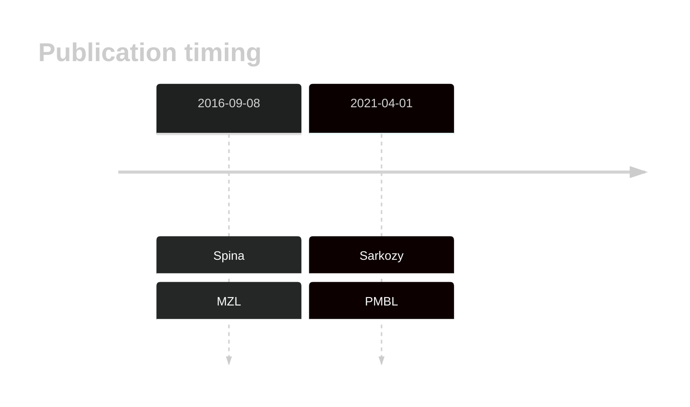

# ABCA13

## History

## Relevance tier by entity

|Entity|Tier|Description|
|:------:|:----:|--------------------------------------|
||2|relevance in MZL not firmly established[@spinaGeneticsNodalMarginal2016b]|
||2|relevance in PMBL/cHL/GZL not firmly established[@sarkozyMutationalLandscapeGray2021a]|

## Mutation incidence in large patient cohorts (GAMBL reanalysis)

|Entity|source |frequency (%)|
|:------:|:----:|:----:|
|BL|GAMBL Exome |16.092 |
|BL|GAMBL Genome |6.178 |
|DLBCL|GAMBL Exome |10.189 |
|DLBCL|GAMBL Genome |7.895 |
|FL|GAMBL Exome |2.006 |
|MCL|GAMBL Genome |3.509 |

## References

