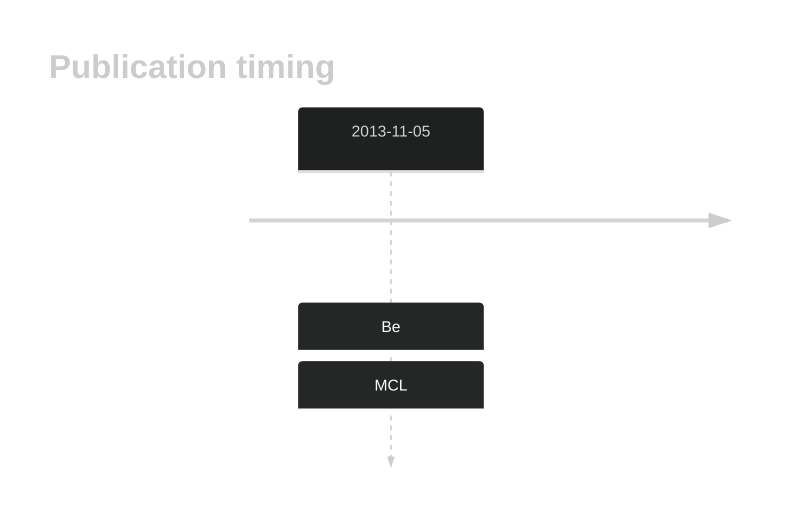

# ABCC9

## History

## Relevance tier by entity

|Entity|Tier|Description|
|:------:|:----:|--------------------------------------|
||2|relevance in MCL not firmly established[@beaLandscapeSomaticMutations2013]|

## Mutation incidence in large patient cohorts (GAMBL reanalysis)

|Entity|source |frequency (%)|
|:------:|:----:|:----:|
|BL|GAMBL Exome |4.598 |
|BL|GAMBL Genome |2.703 |
|DLBCL|GAMBL Exome |3.504 |
|DLBCL|GAMBL Genome |2.632 |
|FL|GAMBL Exome |0.573 |

## References

