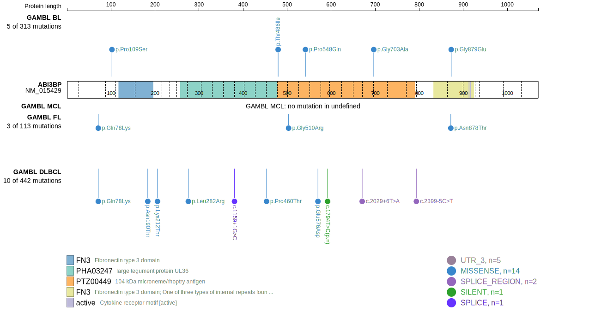
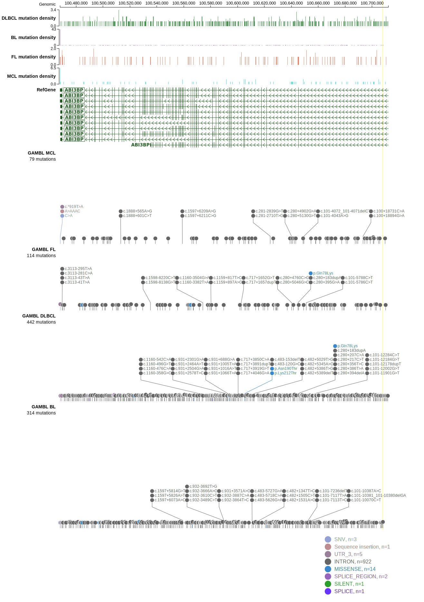
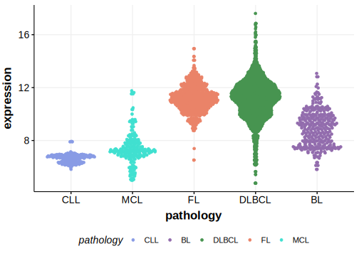

[[_TOC_]]

Mutations were first described in DLBCL in 2013 by Morin et al.1 Subsequent exome and genome-wide studies of DLBCL did not reproduce this observation. 

## Relevance tier by entity

|Entity|Tier|Description                              |
|:------:|:----:|-----------------------------------------|
| |2   |relevance in DLBCL not firmly established[@morinMutationalStructuralAnalysis2013]|

## Mutation incidence in large patient cohorts (GAMBL reanalysis)

[[include:DLBCL_ABI3BP.md]]

## Mutation pattern and selective pressure estimates

[[include:dnds_ABI3BP.md]]

View coding variants in ProteinPaint [hg19](https://morinlab.github.io/LLMPP/GAMBL/ABI3BP_protein.html)  or [hg38](https://morinlab.github.io/LLMPP/GAMBL/ABI3BP_protein_hg38.html)

View all variants in GenomePaint [hg19](https://morinlab.github.io/LLMPP/GAMBL/ABI3BP.html)  or [hg38](https://morinlab.github.io/LLMPP/GAMBL/ABI3BP_hg38.html)

## ABI3BP Expression

## All Mutations

[RG014](https://www.bcgsc.ca/downloads/morinlab/GAMBL/Morin_2013/RG014.html)
[RG054](https://www.bcgsc.ca/downloads/morinlab/GAMBL/Morin_2013/RG054.html)
[RG067](https://www.bcgsc.ca/downloads/morinlab/GAMBL/Morin_2013/RG067.html)
[RG081](https://www.bcgsc.ca/downloads/morinlab/GAMBL/Morin_2013/RG081.html)

[[include:mermaid_ABI3BP.md]]

## References

<!-- ORIGIN: morinMutationalStructuralAnalysis2013 -->
<!-- DLBCL: morinMutationalStructuralAnalysis2013 -->
