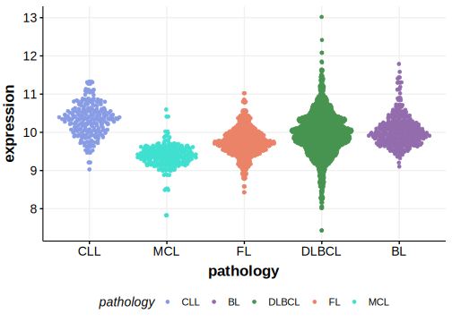

[[_TOC_]]

## Relevance tier by entity

|Entity|Tier|Description                           |
|:------:|:----:|--------------------------------------|
|    |2   |relevance in FL not firmly established[@russler-germainMutationsAssociatedProgression2023]|

## Mutation incidence in large patient cohorts (GAMBL reanalysis)

[[include:FL_ABL2.md]]

## Mutation pattern and selective pressure estimates

[[include:dnds_ABL2.md]]

[[include:browser_ABL2.md]]

## Expression

[[include:mermaid_ABL2.md]]

## References

<!-- ORIGIN: russler-germainMutationsAssociatedProgression2023a -->
<!-- FL: russler-germainMutationsAssociatedProgression2023b -->
