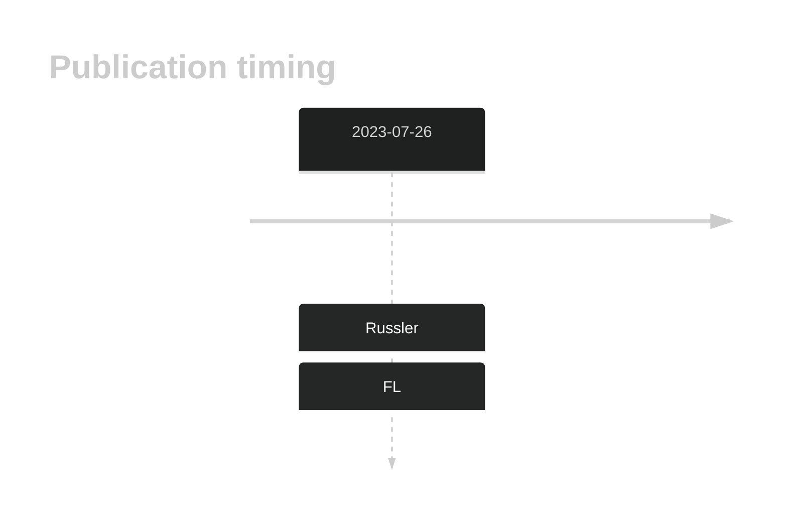

# ABL2

## History

## Relevance tier by entity

|Entity|Tier|Description                           |
|:------:|:----:|--------------------------------------|
|    |2   |relevance in FL not firmly established[@russler-germainMutationsAssociatedProgression2023b]|

## Mutation incidence in large patient cohorts (GAMBL reanalysis)

|Entity|source       |frequency (%)|
|:------:|:-------------:|:-------------:|
|FL    |GAMBL genomes|0.69         |

## Mutation pattern and selective pressure estimates

|Entity|aSHM|Significant selection|dN/dS (missense)|dN/dS (nonsense)|
|:------:|:----:|:---------------------:|:----------------:|:----------------:|
|BL    |No  |No                   |2.14            |0               |
|DLBCL |No  |No                   |0.00            |0               |
|FL    |No  |No                   |0.00            |0               |

View coding variants in ProteinPaint [hg19](https://morinlab.github.io/LLMPP/GAMBL/ABL2_protein.html)  or [hg38](https://morinlab.github.io/LLMPP/GAMBL/ABL2_protein_hg38.html)

View all variants in GenomePaint [hg19](https://morinlab.github.io/LLMPP/GAMBL/ABL2.html)  or [hg38](https://morinlab.github.io/LLMPP/GAMBL/ABL2_hg38.html)

## ABL2 Expression

## References

<!-- ORIGIN: russler-germainMutationsAssociatedProgression2023a -->
<!-- FL: russler-germainMutationsAssociatedProgression2023b -->
