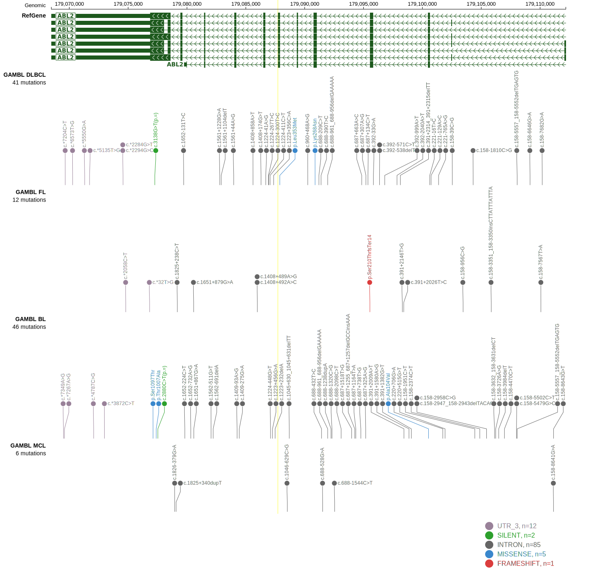

[[_TOC_]]

## Relevance tier by entity

|Entity|Tier|Description                           |
|:------:|:----:|--------------------------------------|
|    |2   |relevance in FL not firmly established[@russler-germainMutationsAssociatedProgression2023]|

## Mutation incidence in large patient cohorts (GAMBL reanalysis)

[[include:FL_ABL2.md]]

## Mutation pattern and selective pressure estimates

[[include:dnds_ABL2.md]]

View coding variants in ProteinPaint [hg19](https://morinlab.github.io/LLMPP/GAMBL/ABL2_protein.html)  or [hg38](https://morinlab.github.io/LLMPP/GAMBL/ABL2_protein_hg38.html)

View all variants in GenomePaint [hg19](https://morinlab.github.io/LLMPP/GAMBL/ABL2.html)  or [hg38](https://morinlab.github.io/LLMPP/GAMBL/ABL2_hg38.html)

## ABL2 Expression

## History

[[include:mermaid_ABL2.md]]

## References

<!-- ORIGIN: russler-germainMutationsAssociatedProgression2023a -->
<!-- FL: russler-germainMutationsAssociatedProgression2023b -->
