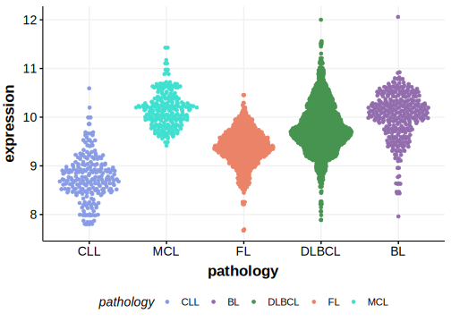

[[_TOC_]]

## Overview
Due to [minimal support](ACAD9#representative-mutation) in the original primary data and very few mutations reported in subsequent studies, this gene is very unlikely to be relevant in BL. 

## Relevance tier by entity

[[include:tables/table1_ACAD9]]

## Warnings

<<Warn("The variants reported in this gene in BL failed QC")>>

## Mutation incidence in large patient cohorts (GAMBL reanalysis)

### BL
[[include:tables/BL_ACAD9]]

## Mutation pattern and selective pressure estimates

[[include:tables/dnds_ACAD9.md]]

[[include:browser_ACAD9.md]]

## Expression

## Representative Mutation

**Rating**
&starf; &star; &star; &star; &star;

## All Mutations

[508](https://www.bcgsc.ca/downloads/morinlab/GAMBL/Love/508_reports.html)
[516](https://www.bcgsc.ca/downloads/morinlab/GAMBL/Love/516_reports.html)
[851](https://www.bcgsc.ca/downloads/morinlab/GAMBL/Love/851_reports.html)

[[include:tables/mermaid_ACAD9.md]]

## References

<!-- ORIGIN: loveGeneticLandscapeMutations2012 -->
<!-- BL: loveGeneticLandscapeMutations2012 -->
