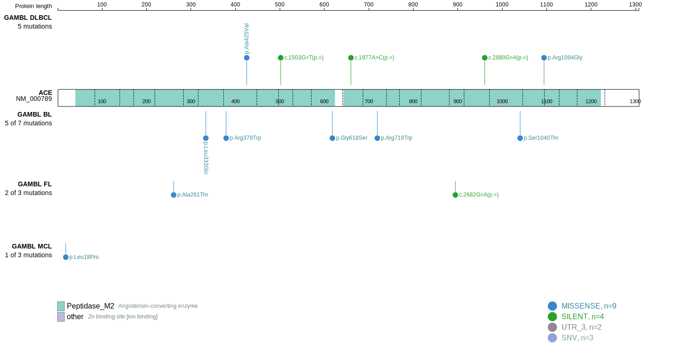
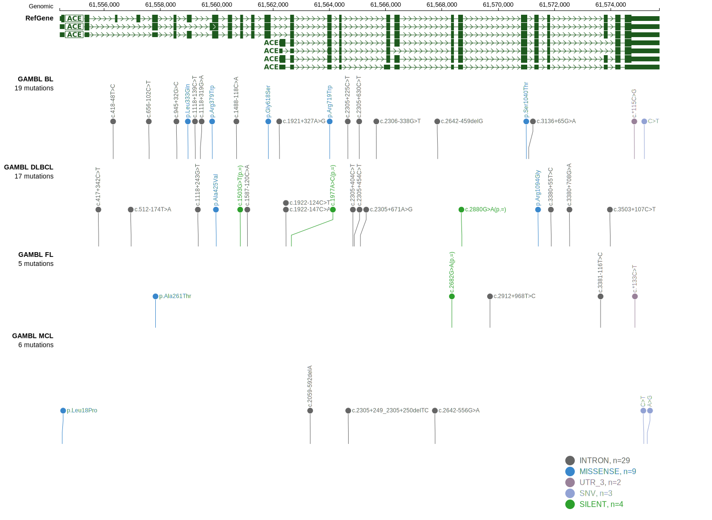

[[_TOC_]]

## Overview

Due to [minimal support](ACE#representative-mutation) in the original primary data and very few mutations reported in subsequent studies, this gene is very unlikely to be relevant in BL. 

<<Warn("The variants reported in this gene in BL failed QC")>>

## Relevance tier by entity

|Entity|Tier|Description                           |
|:------:|:----:|--------------------------------------|
|    |3   |Retired, Failed QC[@loveGeneticLandscapeMutations2012]|

## Mutation incidence in large patient cohorts (GAMBL reanalysis)

|Entity|source               |frequency (%)|
|:------:|:---------------------:|:-------------:|
|BL    |GAMBL genomes+capture|4.39         |
|BL    |Thomas cohort        |  NA         |
|BL    |Panea cohort         |  NA         |

## Mutation pattern and selective pressure estimates

|Entity|aSHM|Significant selection|dN/dS (missense)|dN/dS (nonsense)|
|:------:|:----:|:---------------------:|:----------------:|:----------------:|
|BL    |No  |No                   |3.943           |0               |
|DLBCL |No  |No                   |0.545           |0               |
|FL    |No  |No                   |1.256           |0               |

View coding variants in ProteinPaint [hg19](https://morinlab.github.io/LLMPP/GAMBL/ACE_protein.html)  or [hg38](https://morinlab.github.io/LLMPP/GAMBL/ACE_protein_hg38.html)

View all variants in GenomePaint [hg19](https://morinlab.github.io/LLMPP/GAMBL/ACE.html)  or [hg38](https://morinlab.github.io/LLMPP/GAMBL/ACE_hg38.html)

## ACE Expression

<!-- ORIGIN: loveGeneticLandscapeMutations2012 -->
<!-- BL: loveGeneticLandscapeMutations2012 -->

## Representative Mutation

**Rating** 
&starf; &star; &star; &star; &star;

## All Mutations

[1102](https://www.bcgsc.ca/downloads/morinlab/GAMBL/Love/1102_reports.html)
[668](https://www.bcgsc.ca/downloads/morinlab/GAMBL/Love/668_reports.html)
[677](https://www.bcgsc.ca/downloads/morinlab/GAMBL/Love/677_reports.html)
[744](https://www.bcgsc.ca/downloads/morinlab/GAMBL/Love/744_reports.html)

[[include:mermaid_ACE.md]]

## References
