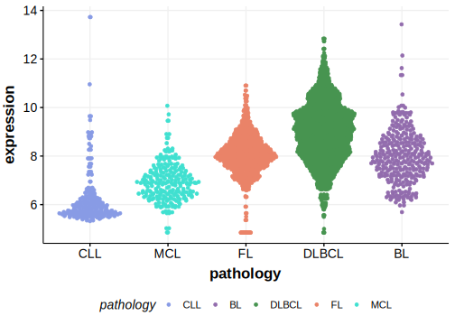
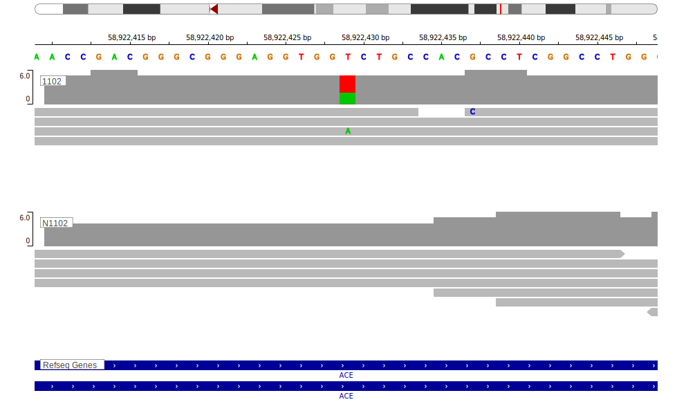

[[_TOC_]]

## Overview

Due to [minimal support](ACE#representative-mutation) in the original primary data and very few mutations reported in subsequent studies, this gene is very unlikely to be relevant in BL. 

## Relevance tier by entity

[[include:tables/table1_ACE]]

## Warnings

<<Warn("The variants reported in this gene in BL failed QC")>>

## Mutation incidence in large patient cohorts (GAMBL reanalysis)

[[include:tables/BL_ACE]]

## Mutation pattern and selective pressure estimates

[[include:tables/dnds_ACE.md]]

[[include:browser_ACE.md]]

## Expression

<!-- ORIGIN: loveGeneticLandscapeMutations2012 -->
<!-- BL: loveGeneticLandscapeMutations2012 -->

## Representative Mutation

**Rating** 
&starf; &star; &star; &star; &star;

## All Mutations

[1102](https://www.bcgsc.ca/downloads/morinlab/GAMBL/Love/1102_reports.html)
[668](https://www.bcgsc.ca/downloads/morinlab/GAMBL/Love/668_reports.html)
[677](https://www.bcgsc.ca/downloads/morinlab/GAMBL/Love/677_reports.html)
[744](https://www.bcgsc.ca/downloads/morinlab/GAMBL/Love/744_reports.html)

[[include:tables/mermaid_ACE.md]]

## References
