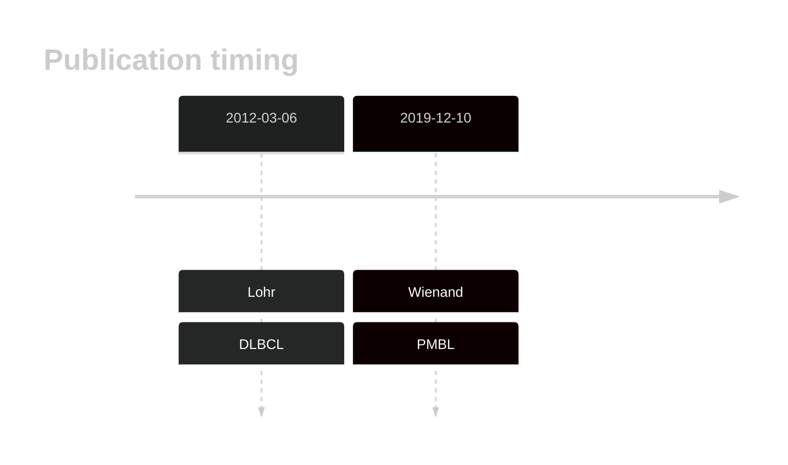
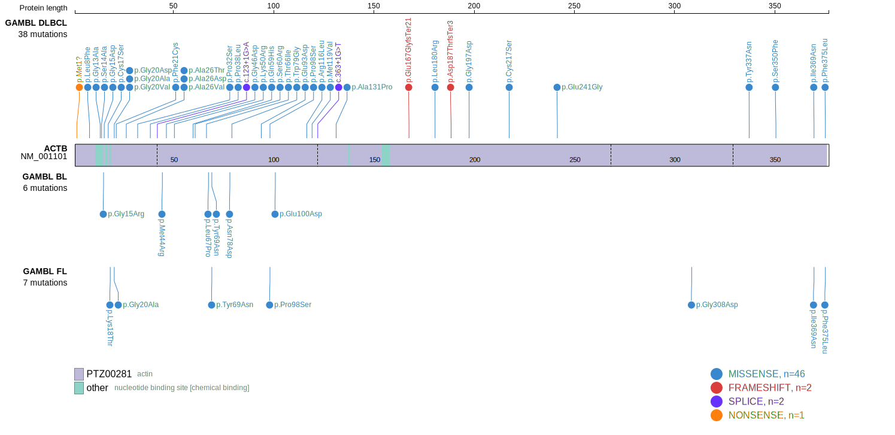
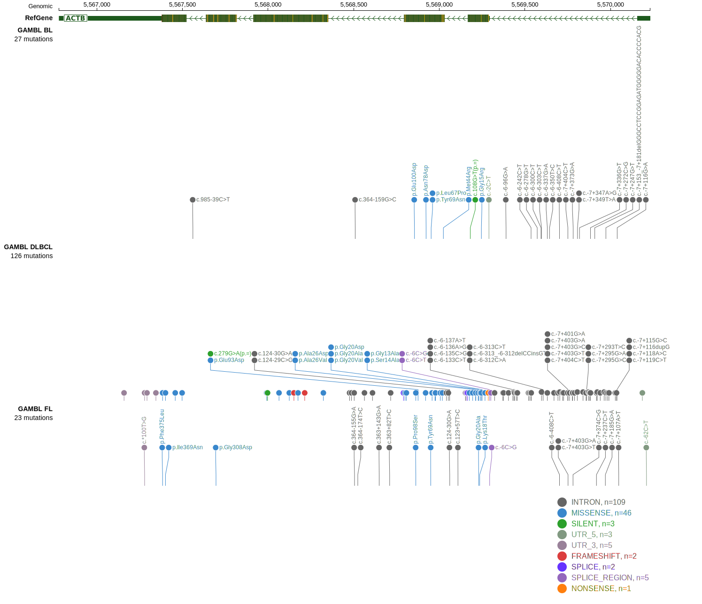
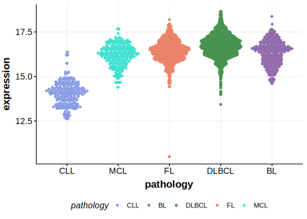

# ACTB

## Overview

ACTB is one of [a number of genes](https://github.com/morinlab/LLMPP/wiki/ashm) affected by aberrant somatic hypermutation in B-cell lymphomas. 
## History

## Relevance tier by entity

|Entity|Tier|Description               |
|:------:|:----:|--------------------------|
||1|high-confidence MZL gene|
||1|high-confidence PMBL/cHL/GZL gene|
| |1-a   |high-confidence DLBCL gene, hypermutated|
|    |1-a   |high-confidence FL gene, hypermutated   |

## Mutation incidence in large patient cohorts (GAMBL reanalysis)

|Entity|source        |frequency (%)|
|:------:|:--------------:|:-------------:|
|DLBCL |GAMBL genomes | 9.18        |
|DLBCL |Schmitz cohort| 9.80        |
|DLBCL |Reddy cohort  | 6.30        |
|DLBCL |Chapuy cohort |12.40        |
|FL    |GAMBL genomes | 5.31        |

## Mutation pattern and selective pressure estimates

|Entity|aSHM|Significant selection|dN/dS (missense)|dN/dS (nonsense)|
|:------:|:----:|:---------------------:|:----------------:|:----------------:|
|BL    |Yes |No                   | 5.217          |0               |
|DLBCL |Yes |No                   | 3.582          |0               |
|FL    |Yes |No                   |10.476          |0               |

## aSHM regions

|chr_name|hg19_start|hg19_end|region                                                                                 |regulatory_comment|
|:--------:|:----------:|:--------:|:---------------------------------------------------------------------------------------:|:------------------:|
|chr7    |5568297   |5570856 |[TSS](https://genome.ucsc.edu/s/rdmorin/GAMBL%20hg19?position=chr7%3A5568297%2D5570856)|active_promoter   |

 ## ACTB Hotspots

| Chromosome |Coordinate (hg19) | ref>alt | HGVSp | 
 | :---:| :---: | :--: | :---: |
| chr7 | 5569176 | G>A | P38L |
| chr7 | 5569024 | A>C | M44R |
| chr7 | 5569018 | C>T | G46D |
| chr7 | 5569006 | T>C | K50R |
| chr7 | 5568978 | C>A | Q59H |
| chr7 | 5568975 | G>C | S60R |
| chr7 | 5568958 | G>A | T66I |
| chr7 | 5568955 | A>G | L67P |
| chr7 | 5568950 | A>T | Y69N |
| chr7 | 5568923 | T>C | N78D |
| chr7 | 5568920 | A>C | W79G |

View coding variants in ProteinPaint [hg19](https://morinlab.github.io/LLMPP/GAMBL/ACTB_protein.html)  or [hg38](https://morinlab.github.io/LLMPP/GAMBL/ACTB_protein_hg38.html)

View all variants in GenomePaint [hg19](https://morinlab.github.io/LLMPP/GAMBL/ACTB.html)  or [hg38](https://morinlab.github.io/LLMPP/GAMBL/ACTB_hg38.html)

## ACTB Expression

## References
1. *Lohr JG, Stojanov P, Lawrence MS, Auclair D, Chapuy B, Sougnez C, Cruz-Gordillo P, Knoechel B, Asmann YW, Slager SL, Novak AJ, Dogan A, Ansell SM, Link BK, Zou L, Gould J, Saksena G, Stransky N, Rangel-Escareño C, Fernandez-Lopez JC, Hidalgo-Miranda A, Melendez-Zajgla J, Hernández-Lemus E, Schwarz-Cruz y Celis A, Imaz-Rosshandler I, Ojesina AI, Jung J, Pedamallu CS, Lander ES, Habermann TM, Cerhan JR, Shipp MA, Getz G, Golub TR. Discovery and prioritization of somatic mutations in diffuse large B-cell lymphoma (DLBCL) by whole-exome sequencing. Proc Natl Acad Sci U S A. 2012 Mar 6;109(10):3879-84. doi: 10.1073/pnas.1121343109. Epub 2012 Feb 17. PMID: 22343534; PMCID: PMC3309757.*

<!-- ORIGIN: lohrDiscoveryPrioritizationSomatic2012a -->
<!-- PMBL: wienandGenomicAnalysesFlowsorted2019b -->
<!-- DLBCL: lohrDiscoveryPrioritizationSomatic2012a -->
