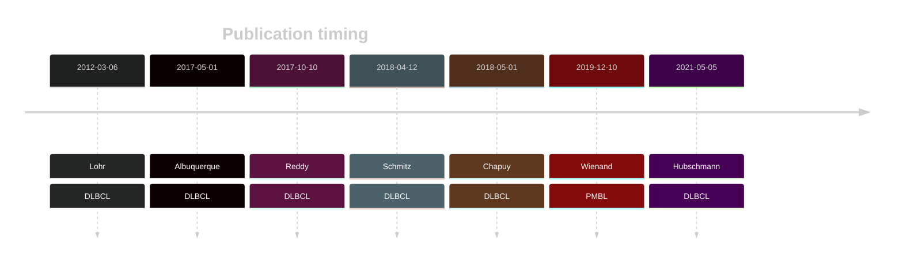

# ACTB

## Overview

ACTB is one of [a number of genes](https://github.com/morinlab/LLMPP/wiki/ashm) affected by aberrant somatic hypermutation in B-cell lymphomas. The function of mutations in ACTB and ACTG1 have not yet been determined.[@witjesPrevalenceCytoplasmicActin2020]

## History

## Relevance tier by entity

|Entity|Tier|Description               |
|:------:|:----:|--------------------------|
||1|high-confidence MZL gene|
||1|high-confidence PMBL/cHL/GZL gene[@wienandGenomicAnalysesFlowsorted2019]|
| |1   |high-confidence DLBCL gene, hypermutated[@lohrDiscoveryPrioritizationSomatic2012]|
|    |1  |high-confidence FL gene, hypermutated   |

## Mutation incidence in large patient cohorts (GAMBL reanalysis)

[[include:DLBCL_ACTB.md]]

## Mutation pattern and selective pressure estimates

|Entity|aSHM|Significant selection|dN/dS (missense)|dN/dS (nonsense)|
|:------:|:----:|:---------------------:|:----------------:|:----------------:|
|BL    |Yes |No                   | 5.217          |0               |
|DLBCL |Yes |No                   | 3.582          |0               |
|FL    |Yes |No                   |10.476          |0               |

## aSHM regions

|chr_name|hg19_start|hg19_end|region                                                                                 |regulatory_comment|
|:--------:|:----------:|:--------:|:---------------------------------------------------------------------------------------:|:------------------:|
|chr7    |5568297   |5570856 |[TSS](https://genome.ucsc.edu/s/rdmorin/GAMBL%20hg19?position=chr7%3A5568297%2D5570856)|active_promoter   |

## ACTB Hotspots

| Chromosome |Coordinate (hg19) | ref>alt | HGVSp | 
 | :---:| :---: | :--: | :---: |
| chr7 | 5569176 | G>A | P38L |
| chr7 | 5569024 | A>C | M44R |
| chr7 | 5569018 | C>T | G46D |
| chr7 | 5569006 | T>C | K50R |
| chr7 | 5568978 | C>A | Q59H |
| chr7 | 5568975 | G>C | S60R |
| chr7 | 5568958 | G>A | T66I |
| chr7 | 5568955 | A>G | L67P |
| chr7 | 5568950 | A>T | Y69N |
| chr7 | 5568923 | T>C | N78D |
| chr7 | 5568920 | A>C | W79G |

View coding variants in ProteinPaint [hg19](https://morinlab.github.io/LLMPP/GAMBL/ACTB_protein.html)  or [hg38](https://morinlab.github.io/LLMPP/GAMBL/ACTB_protein_hg38.html)

View all variants in GenomePaint [hg19](https://morinlab.github.io/LLMPP/GAMBL/ACTB.html)  or [hg38](https://morinlab.github.io/LLMPP/GAMBL/ACTB_hg38.html)

## ACTB Expression

## References

<!-- ORIGIN: lohrDiscoveryPrioritizationSomatic2012a -->
<!-- PMBL: wienandGenomicAnalysesFlowsorted2019b -->
<!-- DLBCL: lohrDiscoveryPrioritizationSomatic2012a -->
