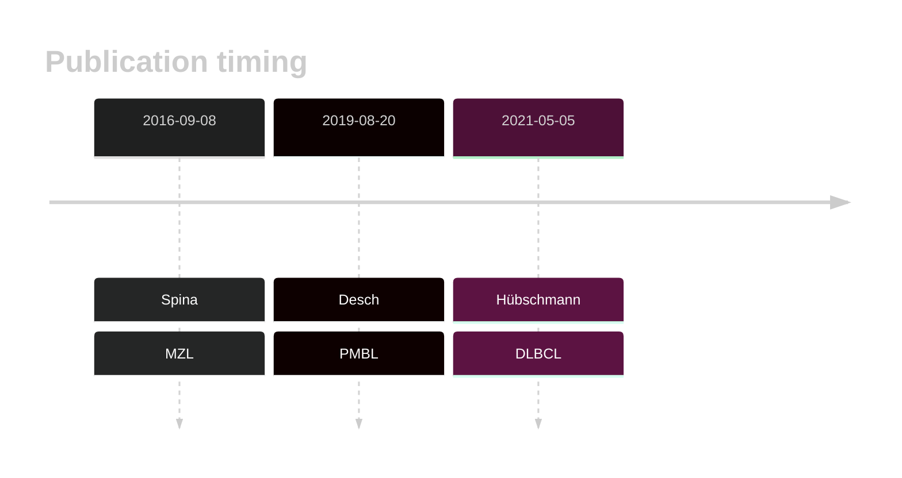
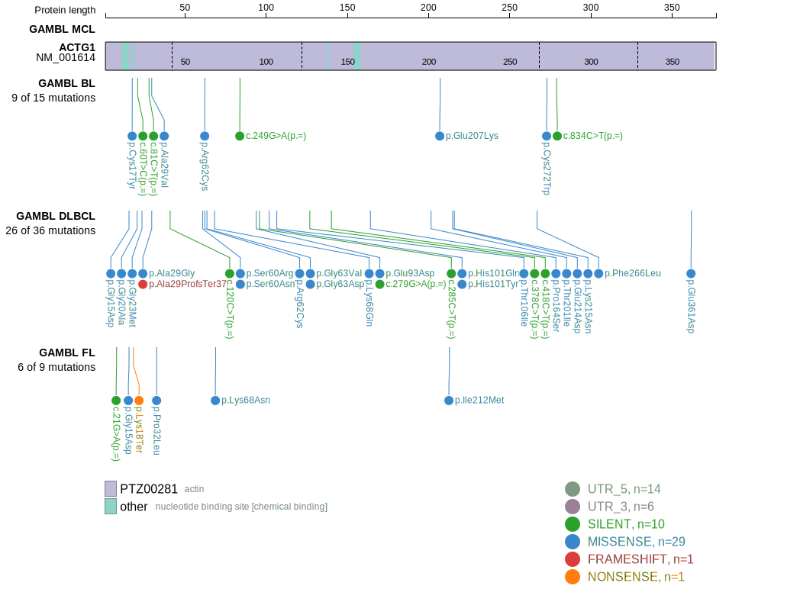
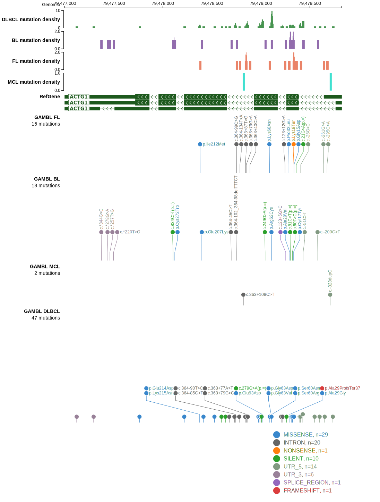

# ACTG1

ACTG1 is one of [a number of genes](https://github.com/morinlab/LLMPP/wiki/ashm) affected by aberrant somatic hypermutation in B-cell lymphomas. The function of mutations in ACTB and ACTG1 have not yet been determined.[@witjesPrevalenceCytoplasmicActin2020]

## History

## Relevance tier by entity

|Entity|Tier|Description                           |
|:------:|:----:|--------------------------------------|
||2|relevance in PMBL/cHL/GZL not firmly established[@deschGenotypingCirculatingTumor2020]|
||2|relevance in MZL not firmly established[@spinaGeneticsNodalMarginal2016]|
||2|relevance in FL not firmly established[@hubschmannMutationalMechanismsShaping2021]|
| |1 | aSHM target and high-confidence DLBCL gene[@hubschmannMutationalMechanismsShaping2021]            |

## Mutation incidence in large patient cohorts (GAMBL reanalysis)

[[include:DLBCL_ACTG1.md]]
[[include:FL_ACTG1.md]]

## Mutation pattern and selective pressure estimates

[[include:dnds_ACTG1.md]]

## aSHM regions

|chr_name|hg19_start|hg19_end|region                                                                                       |regulatory_comment|
|:--------:|:----------:|:--------:|:---------------------------------------------------------------------------------------------:|:------------------:|
|chr17   |79478289  |79479959|[intron](https://genome.ucsc.edu/s/rdmorin/GAMBL%20hg19?position=chr17%3A79478289%2D79479959)|NA                |

View coding variants in ProteinPaint [hg19](https://morinlab.github.io/LLMPP/GAMBL/ACTG1_protein.html)  or [hg38](https://morinlab.github.io/LLMPP/GAMBL/ACTG1_protein_hg38.html)

View all variants in GenomePaint [hg19](https://morinlab.github.io/LLMPP/GAMBL/ACTG1.html)  or [hg38](https://morinlab.github.io/LLMPP/GAMBL/ACTG1_hg38.html)

## ACTG1 Expression

## References

<!-- ORIGIN: spinaGeneticsNodalMarginal2016b -->
<!-- DLBCL: hubschmannMutationalMechanismsShaping2021b -->
<!-- MZL: spinaGeneticsNodalMarginal2016b -->
<!-- FL: hubschmannMutationalMechanismsShaping2021b -->
<!-- PMBL: deschGenotypingCirculatingTumor2020 -->
