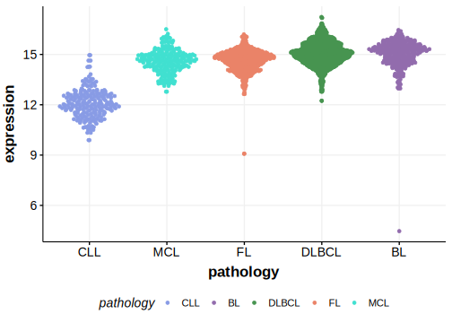

[[_TOC_]]

## Overview

ACTG1 is one of [a number of genes](https://github.com/morinlab/LLMPP/wiki/ashm) affected by aberrant somatic hypermutation in B-cell lymphomas. 
Mutations in this gene were first described in DLBCL and FL in 2021 by [Hübschmann et al](papers/hubschmannMutationalMechanismsShaping2021.md).[@hubschmannMutationalMechanismsShaping2021]
The function of mutations in ACTB and ACTG1 have not yet been determined.[@witjesPrevalenceCytoplasmicActin2020]

## Relevance tier by entity

[[include:tables/table1_ACTG1]]

## Mutation incidence in large patient cohorts (GAMBL reanalysis)

### DLBCL
[[include:tables/DLBCL_ACTG1.md]]

### FL
[[include:tables/FL_ACTG1.md]]

## Mutation pattern and selective pressure estimates

[[include:tables/dnds_ACTG1.md]]

## aSHM regions

|chr_name|hg19_start|hg19_end|region                                                                                       |regulatory_comment|
|:--------:|:----------:|:--------:|:---------------------------------------------------------------------------------------------:|:------------------:|
|chr17   |79478289  |79479959|[intron](https://genome.ucsc.edu/s/rdmorin/GAMBL%20hg19?position=chr17%3A79478289%2D79479959)|NA                |

[[include:browser_ACTG1.md]]

## Expression

[[include:tables/mermaid_ACTG1.md]]

## References

<!-- ORIGIN: spinaGeneticsNodalMarginal2016b -->
<!-- DLBCL: hubschmannMutationalMechanismsShaping2021b -->
<!-- MZL: spinaGeneticsNodalMarginal2016b -->
<!-- FL: hubschmannMutationalMechanismsShaping2021b -->
<!-- PMBL: deschGenotypingCirculatingTumor2020 -->
