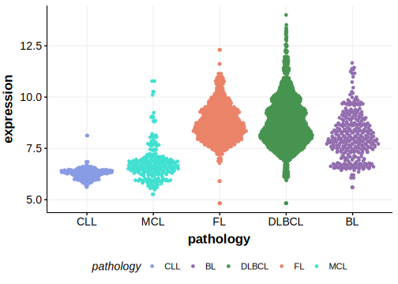

[[_TOC_]]

## Overview

Mutations in this gene were first described in DLBCL in 2021 by Hübschmann et al.[@hubschmannMutationalMechanismsShaping2021]

## Relevance tier by entity

[[include:table1_ADAMTS1]]

## Mutation incidence in large patient cohorts (GAMBL reanalysis)

### DLBCL
[[include:tables/DLBCL_ADAMTS1]]

### FL
[[include:tables/FL_ADAMTS1.md]]

### BL
[[include:tables/BL_ADAMTS1.md]]

### MCL
[[include:tables/MCL_ADAMTS1.md]]

## Mutation pattern and selective pressure estimates

[[include:tables/dnds_ADAMTS1.md]]

[[include:browser_ADAMTS1.md]]

## Expression

## All Mutations

[SP116676](https://www.bcgsc.ca/downloads/morinlab/GAMBL/MALY/SP116676.html)
[SP116697](https://www.bcgsc.ca/downloads/morinlab/GAMBL/MALY/SP116697.html)
[SP193337](https://www.bcgsc.ca/downloads/morinlab/GAMBL/MALY/SP193337.html)

[[include:tables/mermaid_ADAMTS1.md]]

## References

<!-- ORIGIN: hubschmannMutationalMechanismsShaping2021b -->

<!-- DLBCL: hubschmannMutationalMechanismsShaping2021b -->
