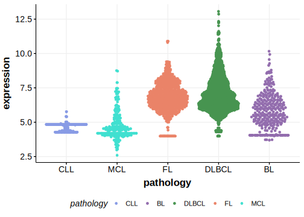

[[_TOC_]]

## Relevance tier by entity

|Entity|Tier|Description                           |
|:------:|:----:|--------------------------------------|
|    |2   |relevance in BL not firmly established[@burkhardtClinicalRelevanceMolecular2022]|

## Mutation incidence in large patient cohorts (GAMBL reanalysis)

### BL

[[include:BL_ADAMTS5.md]]

## Mutation pattern and selective pressure estimates

[[include:dnds_ADAMTS5.md]]

[[include:browser_ADAMTS5.md]]

## Expression

<!-- ORIGIN: burkhardtClinicalRelevanceMolecular2022b -->
<!-- BL: burkhardtClinicalRelevanceMolecular2022b -->

[[include:mermaid_ADAMTS5.md]]

## References
