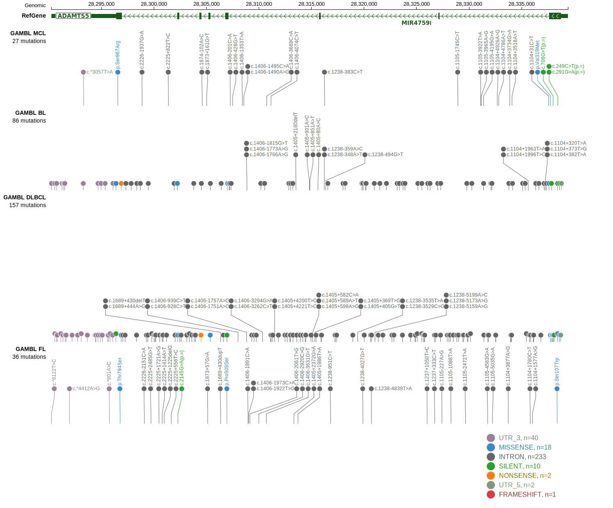

[[_TOC_]]

## Relevance tier by entity

|Entity|Tier|Description                           |
|:------:|:----:|--------------------------------------|
|    |2   |relevance in BL not firmly established[@burkhardtClinicalRelevanceMolecular2022]|

## Mutation incidence in large patient cohorts (GAMBL reanalysis)

### BL

[[include:BL_ADAMTS5.md]]

## Mutation pattern and selective pressure estimates

[[include:dnds_ADAMTS5.md]]

View coding variants in ProteinPaint [hg19](https://morinlab.github.io/LLMPP/GAMBL/ADAMTS5_protein.html)  or [hg38](https://morinlab.github.io/LLMPP/GAMBL/ADAMTS5_protein_hg38.html)

View all variants in GenomePaint [hg19](https://morinlab.github.io/LLMPP/GAMBL/ADAMTS5.html)  or [hg38](https://morinlab.github.io/LLMPP/GAMBL/ADAMTS5_hg38.html)

## ADAMTS5 Expression

<!-- ORIGIN: burkhardtClinicalRelevanceMolecular2022b -->
<!-- BL: burkhardtClinicalRelevanceMolecular2022b -->

[[include:mermaid_ADAMTS5.md]]

## References
