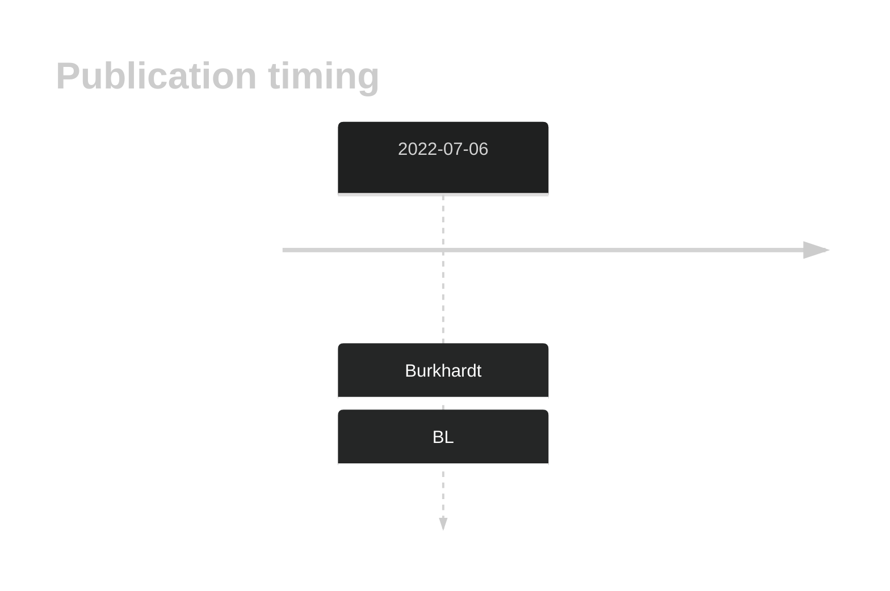
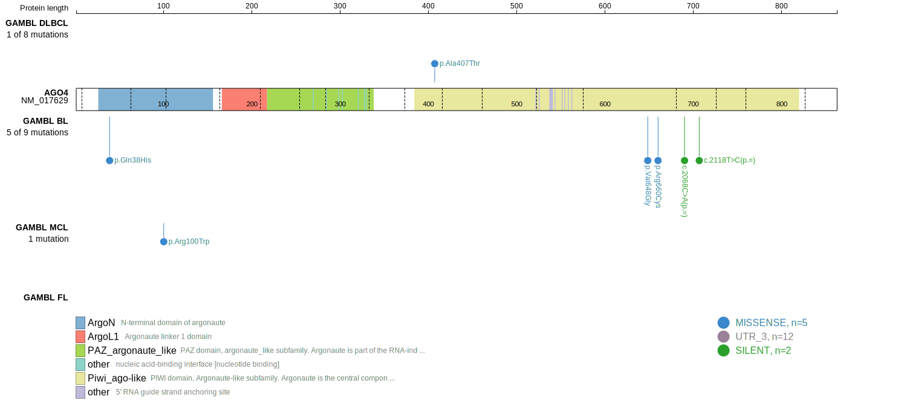
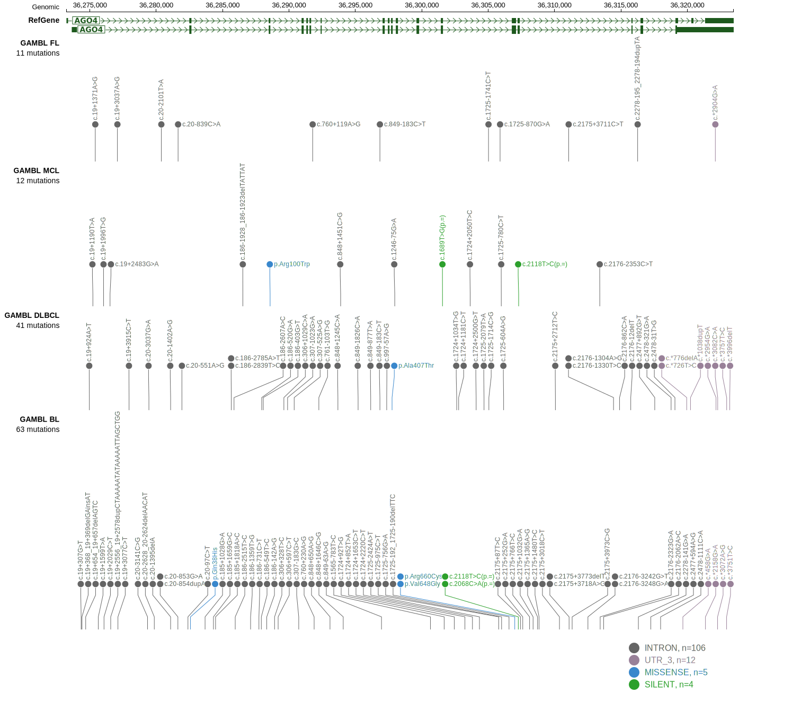
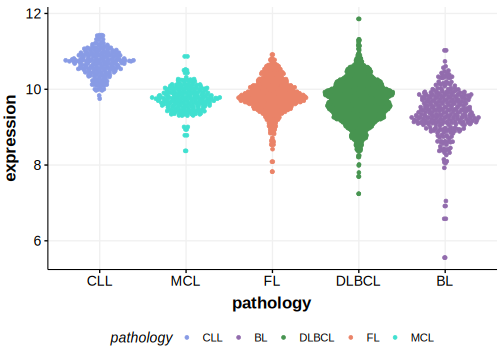

# AGO4

## History

## Relevance tier by entity

|Entity|Tier|Description                           |
|:------:|:----:|--------------------------------------|
|    |2   |relevance in BL not firmly established[@burkhardtClinicalRelevanceMolecular2022b]|

## Mutation incidence in large patient cohorts (GAMBL reanalysis)

|Entity|source               |frequency (%)|
|:------:|:---------------------:|:-------------:|
|BL    |GAMBL genomes+capture|1.15         |
|BL    |Thomas cohort        |  NA         |
|BL    |Panea cohort         |  NA         |

## Mutation pattern and selective pressure estimates

|Entity|aSHM|Significant selection|dN/dS (missense)|dN/dS (nonsense)|
|:------:|:----:|:---------------------:|:----------------:|:----------------:|
|BL    |No  |No                   |1.183           | 0.000          |
|DLBCL |No  |No                   |0.000           |11.202          |
|FL    |No  |No                   |0.000           | 0.000          |

View coding variants in ProteinPaint [hg19](https://morinlab.github.io/LLMPP/GAMBL/AGO4_protein.html)  or [hg38](https://morinlab.github.io/LLMPP/GAMBL/AGO4_protein_hg38.html)

View all variants in GenomePaint [hg19](https://morinlab.github.io/LLMPP/GAMBL/AGO4.html)  or [hg38](https://morinlab.github.io/LLMPP/GAMBL/AGO4_hg38.html)

## AGO4 Expression

<!-- ORIGIN: burkhardtClinicalRelevanceMolecular2022b -->
<!-- BL: burkhardtClinicalRelevanceMolecular2022b -->

## References
