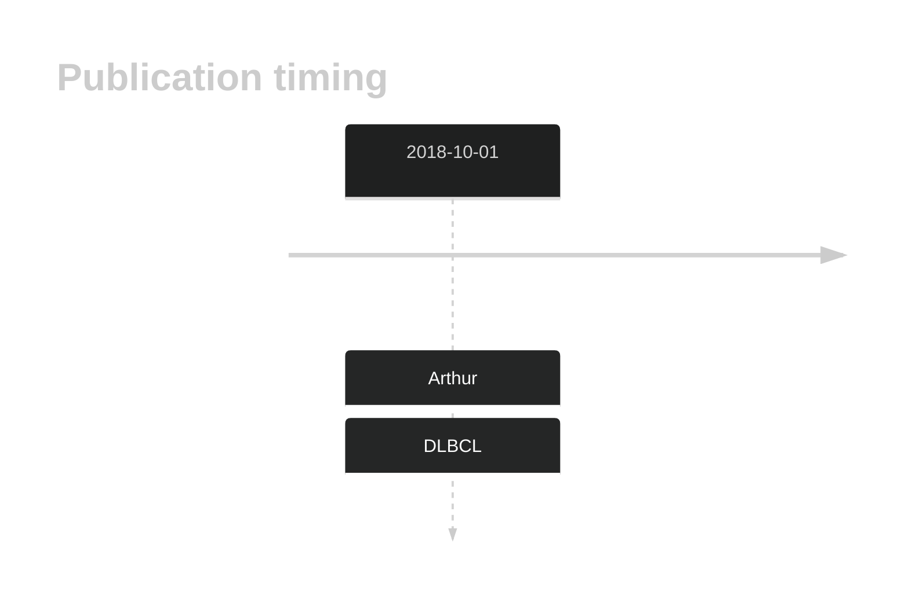
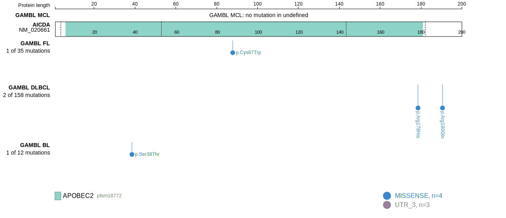
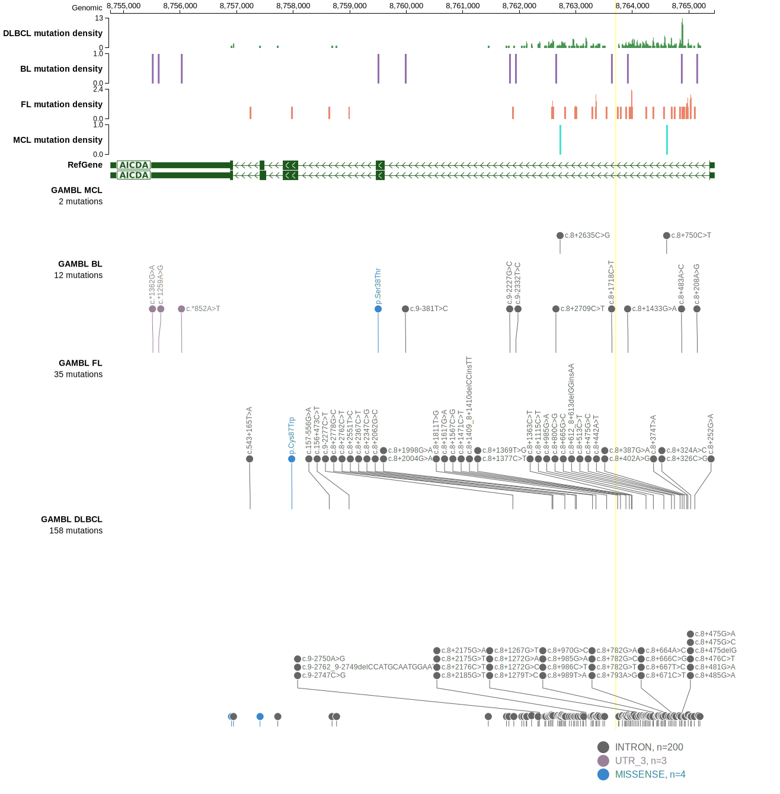

# AICDA

## History

## Relevance tier by entity

|Entity|Tier|Description                              |
|:------:|:----:|-----------------------------------------|
| |2 | aSHM target; Although recurrent, the relevance of mutations in DLBCL is tenuous [@arthurGenomewideDiscoverySomatic2018]|

## Mutation incidence in large patient cohorts (GAMBL reanalysis)

|Entity|source        |frequency (%)|
|:------:|:--------------:|:-------------:|
|DLBCL |GAMBL genomes |0.38         |
|DLBCL |Schmitz cohort|0.43         |
|DLBCL |Reddy cohort  |0.30         |
|DLBCL |Chapuy cohort |0.43         |

## Mutation pattern and selective pressure estimates

|Entity|aSHM|Significant selection|dN/dS (missense)|dN/dS (nonsense)|
|:------:|:----:|:---------------------:|:----------------:|:----------------:|
|BL    |Yes |No                   |2.589           |0               |
|DLBCL |Yes |No                   |2.652           |0               |
|FL    |Yes |No                   |4.955           |0               |

## aSHM regions

|chr_name|hg19_start|hg19_end|region                                                                                  |regulatory_comment|
|:--------:|:----------:|:--------:|:----------------------------------------------------------------------------------------:|:------------------:|
|chr12   |8762328   |8765099 |[TSS](https://genome.ucsc.edu/s/rdmorin/GAMBL%20hg19?position=chr12%3A8762328%2D8765099)|NA                |

View coding variants in ProteinPaint [hg19](https://morinlab.github.io/LLMPP/GAMBL/AICDA_protein.html)  or [hg38](https://morinlab.github.io/LLMPP/GAMBL/AICDA_protein_hg38.html)

View all variants in GenomePaint [hg19](https://morinlab.github.io/LLMPP/GAMBL/AICDA.html)  or [hg38](https://morinlab.github.io/LLMPP/GAMBL/AICDA_hg38.html)

## AICDA Expression

<!-- ORIGIN: arthurGenomewideDiscoverySomatic2018 -->
<!-- DLBCL: arthurGenomewideDiscoverySomatic2018 -->

## References
