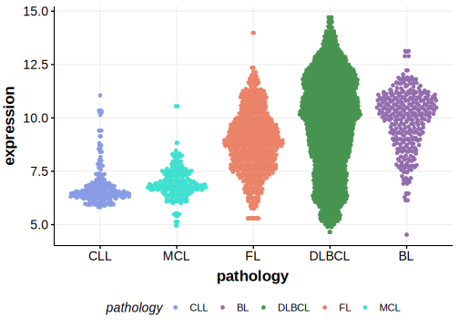

[[_TOC_]]

## Relevance tier by entity

[[include:table1_AICDA]]

## Mutation incidence in large patient cohorts (GAMBL reanalysis)

### DLBCL
[[include:tables/DLBCL_AICDA.md]]

## Mutation pattern and selective pressure estimates

[[include:tables/dnds_AICDA.md]]

## aSHM regions

|chr_name|hg19_start|hg19_end|region                                                                                  |regulatory_comment|
|:--------:|:----------:|:--------:|:--------------------------------------:|:------------------:|
|chr12   |8762328   |8765099 |[TSS](https://genome.ucsc.edu/s/rdmorin/GAMBL%20hg19?position=chr12%3A8762328%2D8765099)|NA                |

[[include:browser_AICDA.md]]

## Expression

<!-- ORIGIN: arthurGenomewideDiscoverySomatic2018 -->
<!-- DLBCL: arthurGenomewideDiscoverySomatic2018 -->

[[include:tables/mermaid_AICDA.md]]

## References
