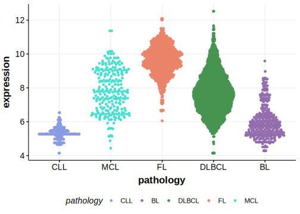
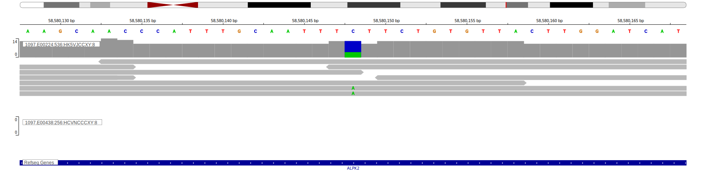
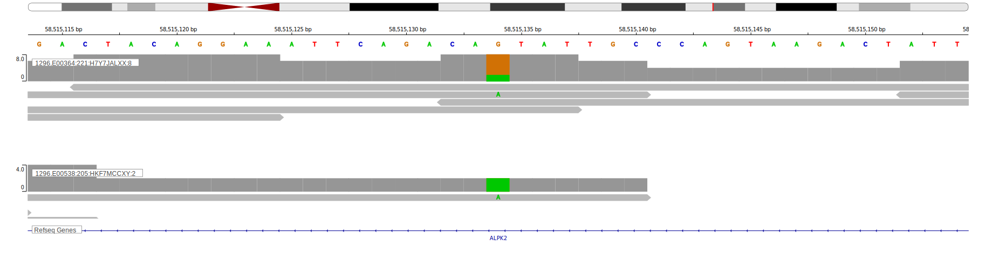

[[_TOC_]]

## Relevance tier by entity

|Entity|Tier|Description                           |
|:------:|:----:|--------------------------------------|
|    |3   |Retired, Failed QC[@paneaWholeGenomeLandscape2019]|

## Warnings

<<Warn("The variants reported in this gene in BL failed QC")>>

## Mutation incidence in large patient cohorts (GAMBL reanalysis)

|Entity|source               |frequency (%)|
|:------:|:---------------------:|:-------------:|
|BL    |GAMBL genomes+capture|3.93         |
|BL    |Thomas cohort        |5.10         |
|BL    |Panea cohort         |9.90         |

## Mutation pattern and selective pressure estimates

[[include:dnds_ALPK2.md]]

## ALPK2 Hotspots

| Chromosome |Coordinate (hg19) | ref>alt | HGVSp | 
 | :---:| :---: | :--: | :---: |
| chr18 | 56203836 | C>T | V1195M |

[[include:browser_ALPK2.md]]

## Expression

<!-- ORIGIN: paneaWholeGenomeLandscape2019 -->
<!-- BL: paneaWholeGenomeLandscape2019 -->

## Representative Mutations[@paneaWholeGenomeLandscape2019]

**Rating**
&starf; &star; &star; &star; &star;

**Rating**
&starf; &star; &star; &star; &star;

[[include:mermaid_ALPK2.md]]

## References
