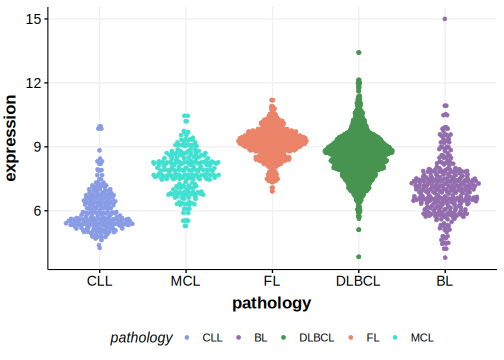

[[_TOC_]]

## Relevance tier by entity

[[include:tables/table1_ANK2.md]]

## Mutation incidence in large patient cohorts (GAMBL reanalysis)

### MCL
[[include:tables/MCL_ANK2.md]]

## Mutation pattern and selective pressure estimates

[[include:tables/dnds_ANK2.md]]

[[include:browser_ANK2.md]]

## Expression

<!-- ORIGIN: zhangGenomicLandscapeMantle2014 -->
<!-- MCL: zhangGenomicLandscapeMantle2014 -->

[[include:tables/mermaid_ANK2.md]]

## References
