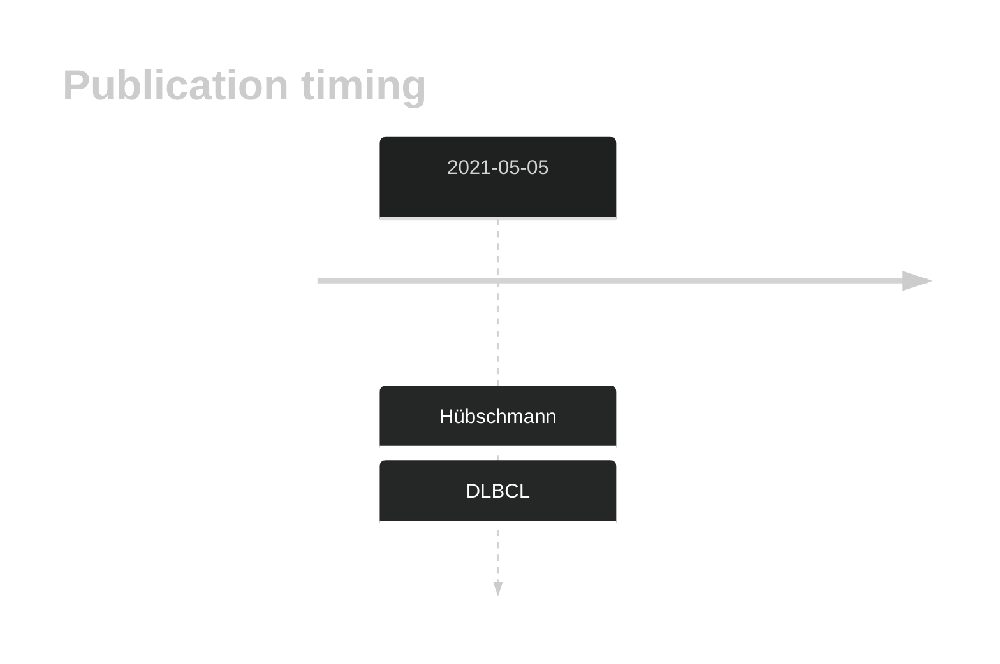
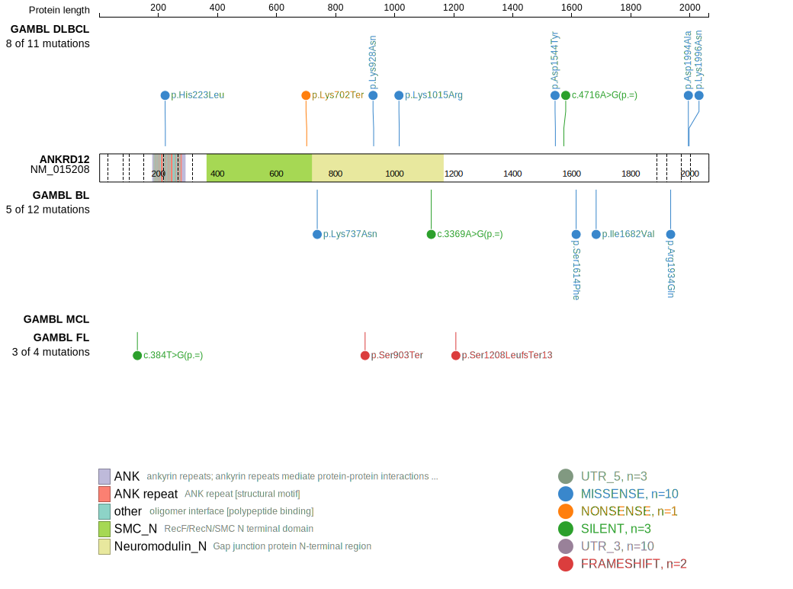
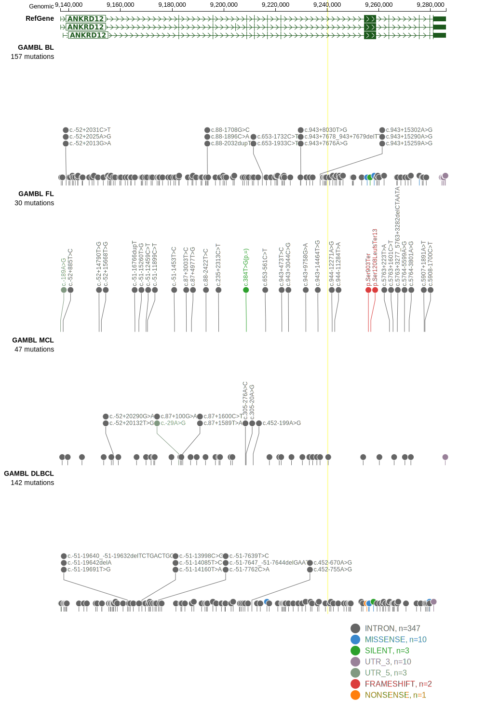

# ANKRD12

## History
Mutations in this gene were first described in DLBCL in 2021 by Hübschmann et al.1

## Relevance tier by entity

|Entity|Tier|Description                              |
|:------:|:----:|-----------------------------------------|
| |2   |relevance in DLBCL not firmly established[@hubschmannMutationalMechanismsShaping2021]|

## Mutation incidence in large patient cohorts (GAMBL reanalysis)

|Entity|source        |frequency (%)|
|:------:|:--------------:|:-------------:|
|DLBCL |GAMBL genomes |2.29         |
|DLBCL |Schmitz cohort|6.17         |
|DLBCL |Reddy cohort  |2.10         |
|DLBCL |Chapuy cohort |5.13         |

## Mutation pattern and selective pressure estimates

|Entity|aSHM|Significant selection|dN/dS (missense)|dN/dS (nonsense)|
|:------:|:----:|:---------------------:|:----------------:|:----------------:|
|BL    |No  |No                   |1.649           |0.000           |
|DLBCL |No  |No                   |0.885           |4.832           |
|FL    |No  |No                   |0.000           |0.000           |

View coding variants in ProteinPaint [hg19](https://morinlab.github.io/LLMPP/GAMBL/ANKRD12_protein.html)  or [hg38](https://morinlab.github.io/LLMPP/GAMBL/ANKRD12_protein_hg38.html)

View all variants in GenomePaint [hg19](https://morinlab.github.io/LLMPP/GAMBL/ANKRD12.html)  or [hg38](https://morinlab.github.io/LLMPP/GAMBL/ANKRD12_hg38.html)

## ANKRD12 Expression

<!-- ORIGIN: hubschmannMutationalMechanismsShaping2021b -->

## All Mutations[@hubschmannMutationalMechanismsShaping2021]

[SP193744](https://www.bcgsc.ca/downloads/morinlab/GAMBL/MALY/SP193744.html)
[SP116697](https://www.bcgsc.ca/downloads/morinlab/GAMBL/MALY/SP116697.html)
[SP116726](https://www.bcgsc.ca/downloads/morinlab/GAMBL/MALY/SP116726.html)
[SP193467](https://www.bcgsc.ca/downloads/morinlab/GAMBL/MALY/SP193467.html)
[SP193681](https://www.bcgsc.ca/downloads/morinlab/GAMBL/MALY/SP193681.html)
[SP194035](https://www.bcgsc.ca/downloads/morinlab/GAMBL/MALY/SP194035.html)
[SP193375](https://www.bcgsc.ca/downloads/morinlab/GAMBL/MALY/SP193375.html)

## References

<!-- DLBCL: hubschmannMutationalMechanismsShaping2021b -->
