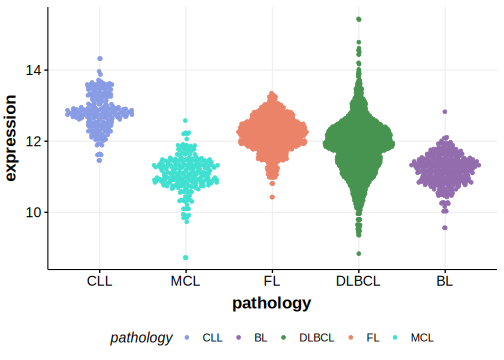

[[_TOC_]]

## Overview

Mutations in this gene were first described in DLBCL in 2021 by Hübschmann et al.[@hubschmannMutationalMechanismsShaping2021]

## Relevance tier by entity

|Entity|Tier|Description                              |
|:------:|:----:|-----------------------------------------|
| |2   |relevance in DLBCL not firmly established[@hubschmannMutationalMechanismsShaping2021]|

## Mutation incidence in large patient cohorts (GAMBL reanalysis)

|Entity|source        |frequency (%)|
|:------:|:--------------:|:-------------:|
|DLBCL |GAMBL genomes |2.29         |
|DLBCL |Schmitz cohort|6.17         |
|DLBCL |Reddy cohort  |2.10         |
|DLBCL |Chapuy cohort |5.13         |

## Mutation pattern and selective pressure estimates

[[include:dnds_ANKRD12.md]]

[[include:browser_ANKRD12.md]]

## Expression

<!-- ORIGIN: hubschmannMutationalMechanismsShaping2021b -->

## All Mutations[@hubschmannMutationalMechanismsShaping2021]

[SP193744](https://www.bcgsc.ca/downloads/morinlab/GAMBL/MALY/SP193744.html)
[SP116697](https://www.bcgsc.ca/downloads/morinlab/GAMBL/MALY/SP116697.html)
[SP116726](https://www.bcgsc.ca/downloads/morinlab/GAMBL/MALY/SP116726.html)
[SP193467](https://www.bcgsc.ca/downloads/morinlab/GAMBL/MALY/SP193467.html)
[SP193681](https://www.bcgsc.ca/downloads/morinlab/GAMBL/MALY/SP193681.html)
[SP194035](https://www.bcgsc.ca/downloads/morinlab/GAMBL/MALY/SP194035.html)
[SP193375](https://www.bcgsc.ca/downloads/morinlab/GAMBL/MALY/SP193375.html)

[[include:mermaid_ANKRD12.md]]

## References

<!-- DLBCL: hubschmannMutationalMechanismsShaping2021b -->
