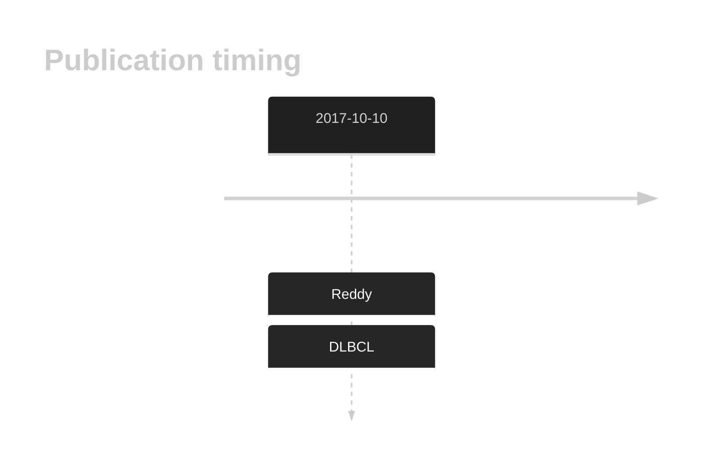

# ANKRD17

<<Warn("The variants reported in this gene in DLBCL failed QC")>>

## History
Mutations in this gene were first described in DLBCL in 2017 by Reddy et al.1 Subsequent exome and genome-wide studies of DLBCL did not reproduce this observation. 

## Relevance tier by entity

|Entity|Tier|Description                              |
|:------:|:----:|-----------------------------------------|
| |2   |relevance in DLBCL not firmly established|

## Mutation incidence in large patient cohorts (GAMBL reanalysis)

|Entity|source        |frequency (%)|
|:------:|:--------------:|:-------------:|
|DLBCL |GAMBL genomes |2.68         |
|DLBCL |Schmitz cohort|4.26         |
|DLBCL |Reddy cohort  |3.80         |
|DLBCL |Chapuy cohort |2.14         |

## Mutation pattern and selective pressure estimates

|Entity|aSHM|Significant selection|dN/dS (missense)|dN/dS (nonsense)|
|:------:|:----:|:---------------------:|:----------------:|:----------------:|
|BL    |No  |No                   |2.047           |8.897           |
|DLBCL |No  |No                   |1.492           |4.437           |
|FL    |No  |No                   |0.000           |0.000           |

View coding variants in ProteinPaint [hg19](https://morinlab.github.io/LLMPP/GAMBL/ANKRD17_protein.html)  or [hg38](https://morinlab.github.io/LLMPP/GAMBL/ANKRD17_protein_hg38.html)

View all variants in GenomePaint [hg19](https://morinlab.github.io/LLMPP/GAMBL/ANKRD17.html)  or [hg38](https://morinlab.github.io/LLMPP/GAMBL/ANKRD17_hg38.html)

## ANKRD17 Expression

## Representative Mutations

&starf; &star; &star; &star; &star;

&starf; &star; &star; &star; &star;

## All Mutations

[Reddy_2262T](https://www.bcgsc.ca/downloads/morinlab/GAMBL/Reddy/igv_reports/Reddy_2262T.html)
[Reddy_2479T](https://www.bcgsc.ca/downloads/morinlab/GAMBL/Reddy/igv_reports/Reddy_2479T.html)
[Reddy_2534T](https://www.bcgsc.ca/downloads/morinlab/GAMBL/Reddy/igv_reports/Reddy_2534T.html)
[Reddy_2629T](https://www.bcgsc.ca/downloads/morinlab/GAMBL/Reddy/igv_reports/Reddy_2629T.html)
[Reddy_2635T](https://www.bcgsc.ca/downloads/morinlab/GAMBL/Reddy/igv_reports/Reddy_2635T.html)
[Reddy_2658T](https://www.bcgsc.ca/downloads/morinlab/GAMBL/Reddy/igv_reports/Reddy_2658T.html)
[Reddy_3419T](https://www.bcgsc.ca/downloads/morinlab/GAMBL/Reddy/igv_reports/Reddy_3419T.html)
[Reddy_3549T](https://www.bcgsc.ca/downloads/morinlab/GAMBL/Reddy/igv_reports/Reddy_3549T.html)
[Reddy_3631T](https://www.bcgsc.ca/downloads/morinlab/GAMBL/Reddy/igv_reports/Reddy_3631T.html)
[Reddy_3700T](https://www.bcgsc.ca/downloads/morinlab/GAMBL/Reddy/igv_reports/Reddy_3700T.html)
[Reddy_3715T](https://www.bcgsc.ca/downloads/morinlab/GAMBL/Reddy/igv_reports/Reddy_3715T.html)
[Reddy_3883T](https://www.bcgsc.ca/downloads/morinlab/GAMBL/Reddy/igv_reports/Reddy_3883T.html)
[Reddy_3913T](https://www.bcgsc.ca/downloads/morinlab/GAMBL/Reddy/igv_reports/Reddy_3913T.html)
[Reddy_3945T](https://www.bcgsc.ca/downloads/morinlab/GAMBL/Reddy/igv_reports/Reddy_3945T.html)
[Reddy_3977T](https://www.bcgsc.ca/downloads/morinlab/GAMBL/Reddy/igv_reports/Reddy_3977T.html)

## References
1.  *Reddy A, Zhang J, Davis NS, Moffitt AB, Love CL, Waldrop A, Leppa S, Pasanen A, Meriranta L, Karjalainen-Lindsberg ML, Nørgaard P, Pedersen M, Gang AO, Høgdall E, Heavican TB, Lone W, Iqbal J, Qin Q, Li G, Kim SY, Healy J, Richards KL, Fedoriw Y, Bernal-Mizrachi L, Koff JL, Staton AD, Flowers CR, Paltiel O, Goldschmidt N, Calaminici M, Clear A, Gribben J, Nguyen E, Czader MB, Ondrejka SL, Collie A, Hsi ED, Tse E, Au-Yeung RKH, Kwong YL, Srivastava G, Choi WWL, Evens AM, Pilichowska M, Sengar M, Reddy N, Li S, Chadburn A, Gordon LI, Jaffe ES, Levy S, Rempel R, Tzeng T, Happ LE, Dave T, Rajagopalan D, Datta J, Dunson DB, Dave SS. Genetic and Functional Drivers of Diffuse Large B Cell Lymphoma. Cell. 2017 Oct;171(2):481-494.e15.* 

<!-- ORIGIN: reddyGeneticFunctionalDrivers2017 -->
<!-- DLBCL: reddyGeneticFunctionalDrivers2017 -->
