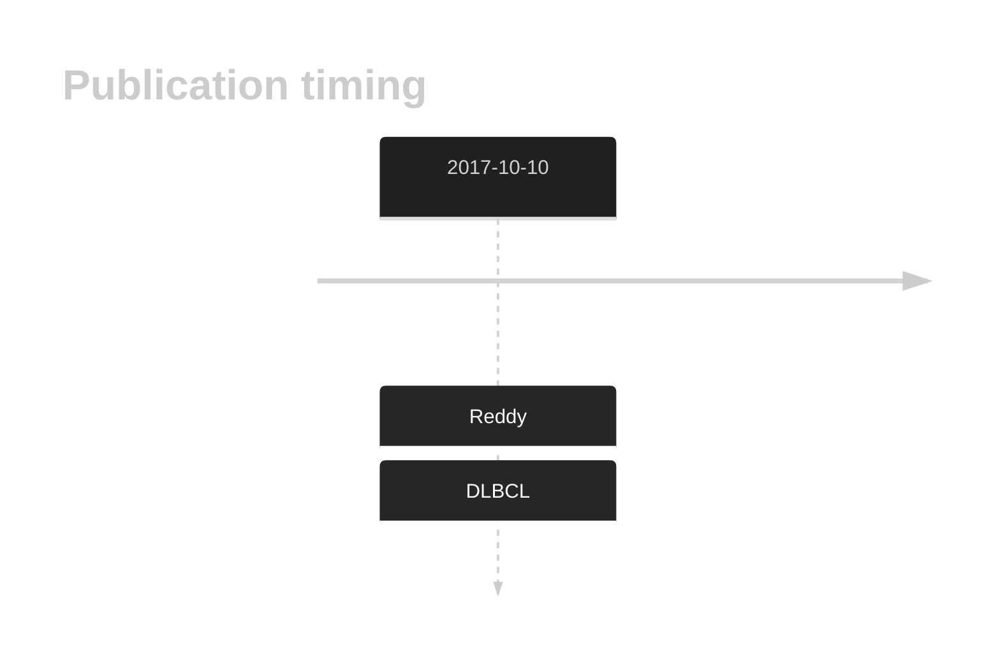
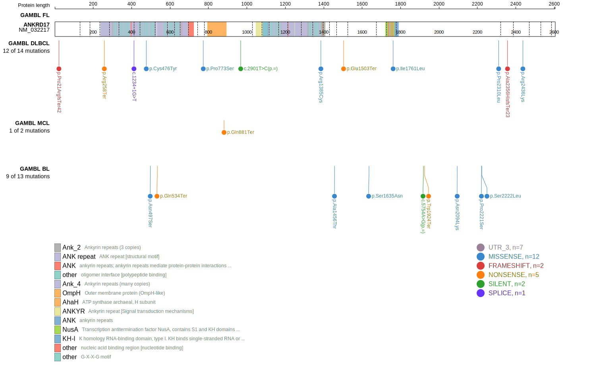
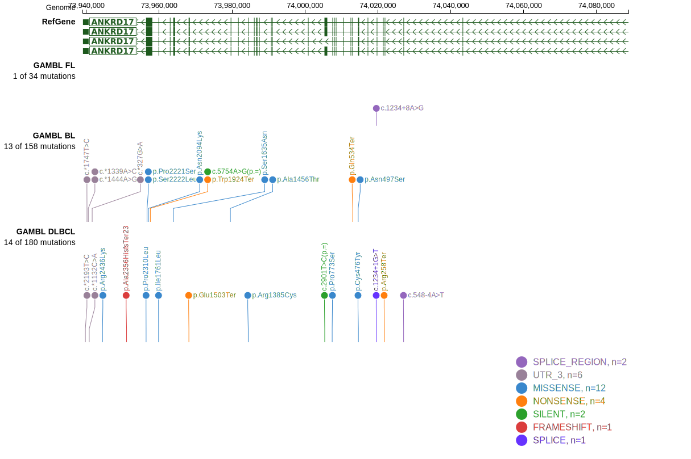
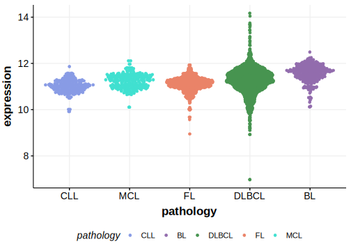

# ANKRD17

<<Warn("The variants reported in this gene in DLBCL failed QC")>>

## History
Mutations in this gene were first described in DLBCL in 2017 by Reddy et al.1 Subsequent exome and genome-wide studies of DLBCL did not reproduce this observation. 

## Relevance tier by entity

|Entity|Tier|Description                              |
|:------:|:----:|-----------------------------------------|
| |2   |relevance in DLBCL not firmly established[@reddyGeneticFunctionalDrivers2017]|

## Mutation incidence in large patient cohorts (GAMBL reanalysis)

|Entity|source        |frequency (%)|
|:------:|:--------------:|:-------------:|
|DLBCL |GAMBL genomes |2.68         |
|DLBCL |Schmitz cohort|4.26         |
|DLBCL |Reddy cohort  |3.80         |
|DLBCL |Chapuy cohort |2.14         |

## Mutation pattern and selective pressure estimates

|Entity|aSHM|Significant selection|dN/dS (missense)|dN/dS (nonsense)|
|:------:|:----:|:---------------------:|:----------------:|:----------------:|
|BL    |No  |No                   |2.047           |8.897           |
|DLBCL |No  |No                   |1.492           |4.437           |
|FL    |No  |No                   |0.000           |0.000           |

View coding variants in ProteinPaint [hg19](https://morinlab.github.io/LLMPP/GAMBL/ANKRD17_protein.html)  or [hg38](https://morinlab.github.io/LLMPP/GAMBL/ANKRD17_protein_hg38.html)

View all variants in GenomePaint [hg19](https://morinlab.github.io/LLMPP/GAMBL/ANKRD17.html)  or [hg38](https://morinlab.github.io/LLMPP/GAMBL/ANKRD17_hg38.html)

## ANKRD17 Expression

## Representative Mutations[@reddyGeneticFunctionalDrivers2017]

&starf; &star; &star; &star; &star;

&starf; &star; &star; &star; &star;

## All Mutations[@reddyGeneticFunctionalDrivers2017]

[Reddy_1016T](https://www.bcgsc.ca/downloads/morinlab/GAMBL/Reddy/igv_reports/Reddy_1016T.html)
[Reddy_2045T](https://www.bcgsc.ca/downloads/morinlab/GAMBL/Reddy/igv_reports/Reddy_2045T.html)
[Reddy_2144T](https://www.bcgsc.ca/downloads/morinlab/GAMBL/Reddy/igv_reports/Reddy_2144T.html)
[Reddy_2153T](https://www.bcgsc.ca/downloads/morinlab/GAMBL/Reddy/igv_reports/Reddy_2153T.html)
[Reddy_2262T](https://www.bcgsc.ca/downloads/morinlab/GAMBL/Reddy/igv_reports/Reddy_2262T.html)
[Reddy_2297T](https://www.bcgsc.ca/downloads/morinlab/GAMBL/Reddy/igv_reports/Reddy_2297T.html)
[Reddy_2471T](https://www.bcgsc.ca/downloads/morinlab/GAMBL/Reddy/igv_reports/Reddy_2471T.html)
[Reddy_2479T](https://www.bcgsc.ca/downloads/morinlab/GAMBL/Reddy/igv_reports/Reddy_2479T.html)
[Reddy_2534T](https://www.bcgsc.ca/downloads/morinlab/GAMBL/Reddy/igv_reports/Reddy_2534T.html)
[Reddy_2567T](https://www.bcgsc.ca/downloads/morinlab/GAMBL/Reddy/igv_reports/Reddy_2567T.html)
[Reddy_2616T](https://www.bcgsc.ca/downloads/morinlab/GAMBL/Reddy/igv_reports/Reddy_2616T.html)
[Reddy_2629T](https://www.bcgsc.ca/downloads/morinlab/GAMBL/Reddy/igv_reports/Reddy_2629T.html)
[Reddy_2635T](https://www.bcgsc.ca/downloads/morinlab/GAMBL/Reddy/igv_reports/Reddy_2635T.html)
[Reddy_2658T](https://www.bcgsc.ca/downloads/morinlab/GAMBL/Reddy/igv_reports/Reddy_2658T.html)
[Reddy_2675T](https://www.bcgsc.ca/downloads/morinlab/GAMBL/Reddy/igv_reports/Reddy_2675T.html)
[Reddy_2715T](https://www.bcgsc.ca/downloads/morinlab/GAMBL/Reddy/igv_reports/Reddy_2715T.html)
[Reddy_2775T](https://www.bcgsc.ca/downloads/morinlab/GAMBL/Reddy/igv_reports/Reddy_2775T.html)
[Reddy_2791T](https://www.bcgsc.ca/downloads/morinlab/GAMBL/Reddy/igv_reports/Reddy_2791T.html)
[Reddy_2808T](https://www.bcgsc.ca/downloads/morinlab/GAMBL/Reddy/igv_reports/Reddy_2808T.html)
[Reddy_2820T](https://www.bcgsc.ca/downloads/morinlab/GAMBL/Reddy/igv_reports/Reddy_2820T.html)
[Reddy_2827T](https://www.bcgsc.ca/downloads/morinlab/GAMBL/Reddy/igv_reports/Reddy_2827T.html)
[Reddy_2838T](https://www.bcgsc.ca/downloads/morinlab/GAMBL/Reddy/igv_reports/Reddy_2838T.html)
[Reddy_2936T](https://www.bcgsc.ca/downloads/morinlab/GAMBL/Reddy/igv_reports/Reddy_2936T.html)
[Reddy_2999T](https://www.bcgsc.ca/downloads/morinlab/GAMBL/Reddy/igv_reports/Reddy_2999T.html)
[Reddy_3407T](https://www.bcgsc.ca/downloads/morinlab/GAMBL/Reddy/igv_reports/Reddy_3407T.html)
[Reddy_3409T](https://www.bcgsc.ca/downloads/morinlab/GAMBL/Reddy/igv_reports/Reddy_3409T.html)
[Reddy_3419T](https://www.bcgsc.ca/downloads/morinlab/GAMBL/Reddy/igv_reports/Reddy_3419T.html)
[Reddy_3438T](https://www.bcgsc.ca/downloads/morinlab/GAMBL/Reddy/igv_reports/Reddy_3438T.html)
[Reddy_3472T](https://www.bcgsc.ca/downloads/morinlab/GAMBL/Reddy/igv_reports/Reddy_3472T.html)
[Reddy_3525T](https://www.bcgsc.ca/downloads/morinlab/GAMBL/Reddy/igv_reports/Reddy_3525T.html)
[Reddy_3545T](https://www.bcgsc.ca/downloads/morinlab/GAMBL/Reddy/igv_reports/Reddy_3545T.html)
[Reddy_3549T](https://www.bcgsc.ca/downloads/morinlab/GAMBL/Reddy/igv_reports/Reddy_3549T.html)
[Reddy_3552T](https://www.bcgsc.ca/downloads/morinlab/GAMBL/Reddy/igv_reports/Reddy_3552T.html)
[Reddy_3584T](https://www.bcgsc.ca/downloads/morinlab/GAMBL/Reddy/igv_reports/Reddy_3584T.html)
[Reddy_3631T](https://www.bcgsc.ca/downloads/morinlab/GAMBL/Reddy/igv_reports/Reddy_3631T.html)
[Reddy_3667T](https://www.bcgsc.ca/downloads/morinlab/GAMBL/Reddy/igv_reports/Reddy_3667T.html)
[Reddy_3691T](https://www.bcgsc.ca/downloads/morinlab/GAMBL/Reddy/igv_reports/Reddy_3691T.html)
[Reddy_3700T](https://www.bcgsc.ca/downloads/morinlab/GAMBL/Reddy/igv_reports/Reddy_3700T.html)
[Reddy_3709T](https://www.bcgsc.ca/downloads/morinlab/GAMBL/Reddy/igv_reports/Reddy_3709T.html)
[Reddy_3715T](https://www.bcgsc.ca/downloads/morinlab/GAMBL/Reddy/igv_reports/Reddy_3715T.html)
[Reddy_3725T](https://www.bcgsc.ca/downloads/morinlab/GAMBL/Reddy/igv_reports/Reddy_3725T.html)
[Reddy_3819T](https://www.bcgsc.ca/downloads/morinlab/GAMBL/Reddy/igv_reports/Reddy_3819T.html)
[Reddy_3883T](https://www.bcgsc.ca/downloads/morinlab/GAMBL/Reddy/igv_reports/Reddy_3883T.html)
[Reddy_3885T](https://www.bcgsc.ca/downloads/morinlab/GAMBL/Reddy/igv_reports/Reddy_3885T.html)
[Reddy_3896T](https://www.bcgsc.ca/downloads/morinlab/GAMBL/Reddy/igv_reports/Reddy_3896T.html)
[Reddy_3913T](https://www.bcgsc.ca/downloads/morinlab/GAMBL/Reddy/igv_reports/Reddy_3913T.html)
[Reddy_3916T](https://www.bcgsc.ca/downloads/morinlab/GAMBL/Reddy/igv_reports/Reddy_3916T.html)
[Reddy_3924T](https://www.bcgsc.ca/downloads/morinlab/GAMBL/Reddy/igv_reports/Reddy_3924T.html)
[Reddy_3943T](https://www.bcgsc.ca/downloads/morinlab/GAMBL/Reddy/igv_reports/Reddy_3943T.html)
[Reddy_3945T](https://www.bcgsc.ca/downloads/morinlab/GAMBL/Reddy/igv_reports/Reddy_3945T.html)
[Reddy_3952T](https://www.bcgsc.ca/downloads/morinlab/GAMBL/Reddy/igv_reports/Reddy_3952T.html)
[Reddy_3977T](https://www.bcgsc.ca/downloads/morinlab/GAMBL/Reddy/igv_reports/Reddy_3977T.html)
[Reddy_705T](https://www.bcgsc.ca/downloads/morinlab/GAMBL/Reddy/igv_reports/Reddy_705T.html)

## References

<!-- ORIGIN: reddyGeneticFunctionalDrivers2017 -->
<!-- DLBCL: reddyGeneticFunctionalDrivers2017 -->
