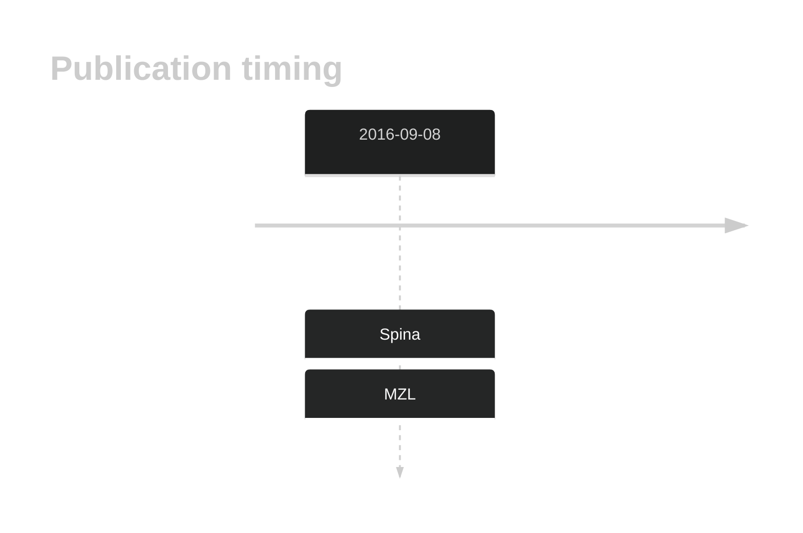

# AOC2

## History

## Relevance tier by entity

|Entity|Tier|Description|
|:------:|:----:|--------------------------------------|
||2|relevance in MZL not firmly established[@spinaGeneticsNodalMarginal2016b]|

## Mutation incidence in large patient cohorts (GAMBL reanalysis)

|Entity|source |frequency (%)|
|:------:|:----:|:----:|
|BL|GAMBL Exome |3.448 |
|BL|GAMBL Genome |0.386 |
|DLBCL|GAMBL Exome |1.563 |
|FL|GAMBL Exome |0.287 |

## References

