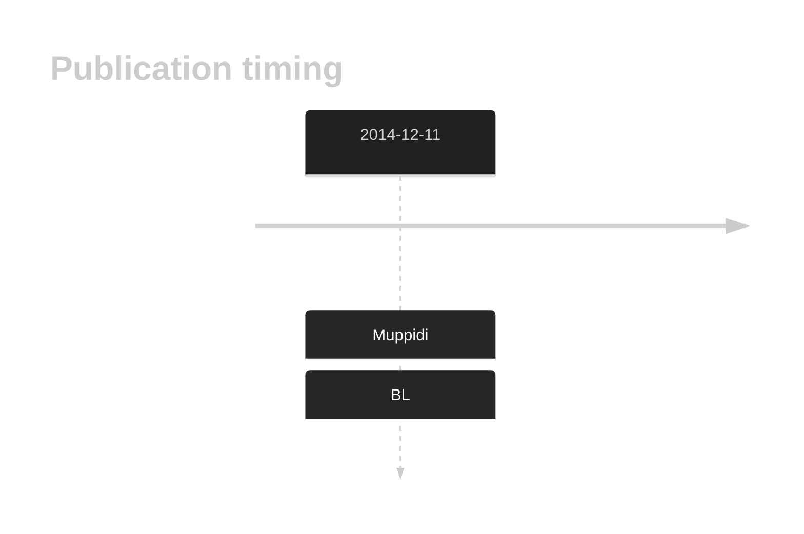
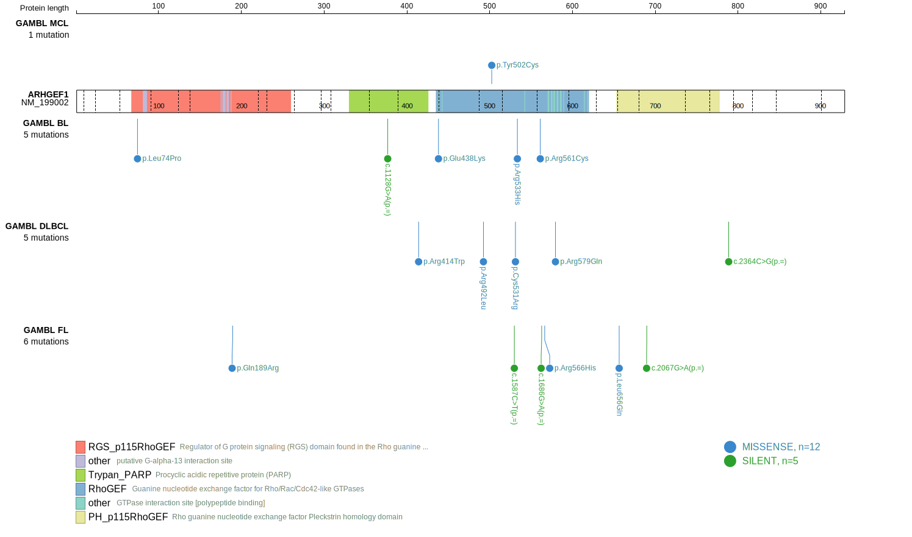
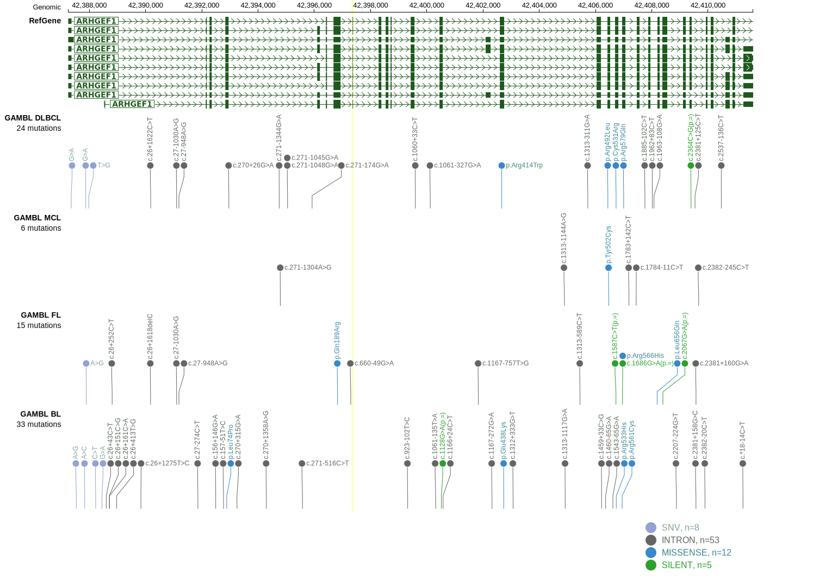
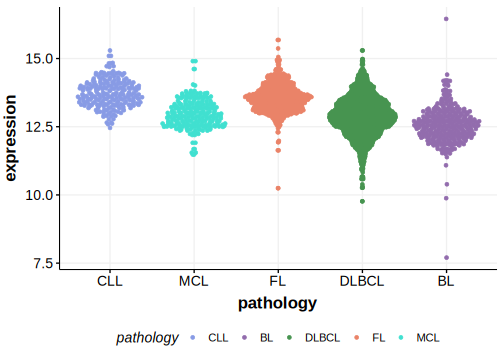

# ARHGEF1
## History

## Relevance tier by entity

|Entity|Tier|Description                           |
|:------:|:----:|--------------------------------------|
|    |2   |relevance in BL not firmly established|

## Mutation incidence in large patient cohorts (GAMBL reanalysis)

|Entity|source               |frequency (%)|
|:------:|:---------------------:|:-------------:|
|BL    |GAMBL genomes+capture|3.93         |
|BL    |Thomas cohort        |2.00         |
|BL    |Panea cohort         |  NA         |

## Mutation pattern and selective pressure estimates

|Entity|aSHM|Significant selection|dN/dS (missense)|dN/dS (nonsense)|
|:------:|:----:|:---------------------:|:----------------:|:----------------:|
|BL    |No  |No                   |2.954           |0.000           |
|DLBCL |No  |No                   |2.662           |9.372           |
|FL    |No  |No                   |3.865           |0.000           |

View coding variants in ProteinPaint [hg19](https://morinlab.github.io/LLMPP/GAMBL/ARHGEF1_protein.html)  or [hg38](https://morinlab.github.io/LLMPP/GAMBL/ARHGEF1_protein_hg38.html)

View all variants in GenomePaint [hg19](https://morinlab.github.io/LLMPP/GAMBL/ARHGEF1.html)  or [hg38](https://morinlab.github.io/LLMPP/GAMBL/ARHGEF1_hg38.html)

## ARHGEF1 Expression

<!-- ORIGIN: muppidiLossSignalingGa132014b -->
<!-- BL: muppidiLossSignalingGa132014b -->
## References
1.  Muppidi J, Schmitz R, Green JA, Green JA, Xiao W, Larsen AB, Braun S, An J, Xu Y, Rosenwald A, Ott G, Gascoyne R, Rimsza L, Campo E, Jaffe E, Delabie J, Smeland E, Braziel R, Tubbs R, Cook J, Weisenburger D, Chan W, Vaidehi N, Staudt L, Cyster J. Loss of signaling via Gα13 in germinal center B cell-derived lymphoma. Nature. 2014;516:254–258. 
