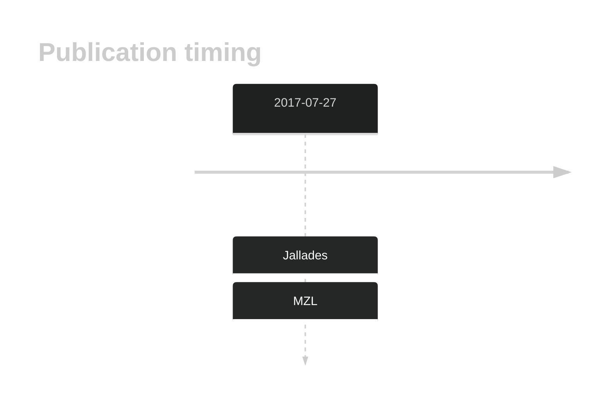

# ARHGEF15

## History

## Relevance tier by entity

|Entity|Tier|Description|
|:------:|:----:|--------------------------------------|
||2|relevance in MZL not firmly established[@jalladesExomeSequencingIdentifies2017]|

## Mutation incidence in large patient cohorts (GAMBL reanalysis)

|Entity|source |frequency (%)|
|:------:|:----:|:----:|
|BL|GAMBL Exome |1.724 |
|DLBCL|GAMBL Exome |1.294 |
|DLBCL|GAMBL Genome |0.188 |
|FL|GAMBL Exome |0.287 |
|MCL|GAMBL Genome |0.585 |

## References

