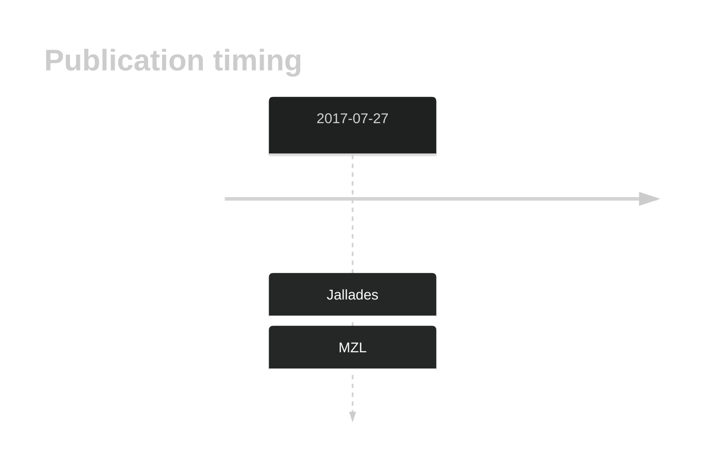

# ARHGEF17

## History

## Relevance tier by entity

|Entity|Tier|Description|
|:------:|:----:|--------------------------------------|
||2|relevance in MZL not firmly established[@jalladesExomeSequencingIdentifies2017]|

## Mutation incidence in large patient cohorts (GAMBL reanalysis)

|Entity|source |frequency (%)|
|:------:|:----:|:----:|
|BL|GAMBL Exome |4.023 |
|BL|GAMBL Genome |1.931 |
|DLBCL|GAMBL Exome |3.558 |
|DLBCL|GAMBL Genome |1.88 |
|MCL|GAMBL Genome |1.17 |

## References

