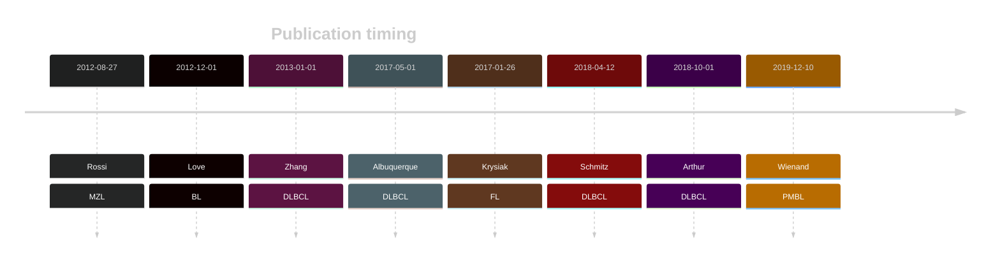

# ARID1A

## Overview

ARID1A (AT-rich interactive domain-containing protein 1A) is a gene that encodes a subunit of the SWI/SNF chromatin remodeling complex, which is involved in regulating DNA accessibility. Mutations in ARID1A are implicated in various cancers, including B-cell lymphomas. They are the most abundant in Burkitt lymphoma but also occur in FL and, to a lesser extent, DLBCL. 
Overall, components of SWI/SNF have been identified as an emerging theme in germinal centre-derived B-cell lymphomas but their role has not been thoroughly elucidated.[@lunningMutationChromatinModifiers2015]

## Relevance tier by entity
|Entity|Tier|Description               |
|:------:|:----:|--------------------------|
||1|high-confidence PMBL/cHL/GZL gene[@wienandGenomicAnalysesFlowsorted2019]|
||1|high-confidence MZL gene[@rossiCodingGenomeSplenic2012]|
|    |1   |high-confidence BL gene   [@loveGeneticLandscapeMutations2012]|
| |1   |high-confidence DLBCL gene[@zhangGeneticHeterogeneityDiffuse2013; @reddyGeneticFunctionalDrivers2017; @hubschmannMutationalMechanismsShaping2021]|
|    |1   |high-confidence FL gene   [@krysiakRecurrentSomaticMutations2017]|

## Mutation incidence in large cohorts

[[include:DLBCL_ARID1A.md]]
[[include:FL_ARID1A.md]]

## Mutation pattern and selective pressure estimates

|Entity|aSHM|Significant selection|dN/dS (missense)|dN/dS (nonsense)|
|:------:|:----:|:---------------------:|:----------------:|:----------------:|
|BL    |No  |Yes                  |3.218           |130.201         |
|DLBCL |No  |Yes                  |2.364           | 38.689         |
|FL    |No  |Yes                  |3.794           |248.722         |

View coding variants in ProteinPaint [hg19](https://morinlab.github.io/LLMPP/GAMBL/ARID1A_protein.html)  or [hg38](https://morinlab.github.io/LLMPP/GAMBL/ARID1A_protein_hg38.html)

View all variants in GenomePaint [hg19](https://morinlab.github.io/LLMPP/GAMBL/ARID1A.html)  or [hg38](https://morinlab.github.io/LLMPP/GAMBL/ARID1A_hg38.html)

## ARID1A Expression

<!-- ORIGIN: loveGeneticLandscapeMutations2012 -->
<!-- MZL: rossiCodingGenomeSplenic2012c -->
<!-- DLBCL: zhangGeneticHeterogeneityDiffuse2013 -->
<!-- BL: loveGeneticLandscapeMutations2012 -->
<!-- FL: krysiakRecurrentSomaticMutations2017b -->
<!-- BL: loveGeneticLandscapeMutations2012 -->

## References

<!-- PMBL: wienandGenomicAnalysesFlowsorted2019b -->
