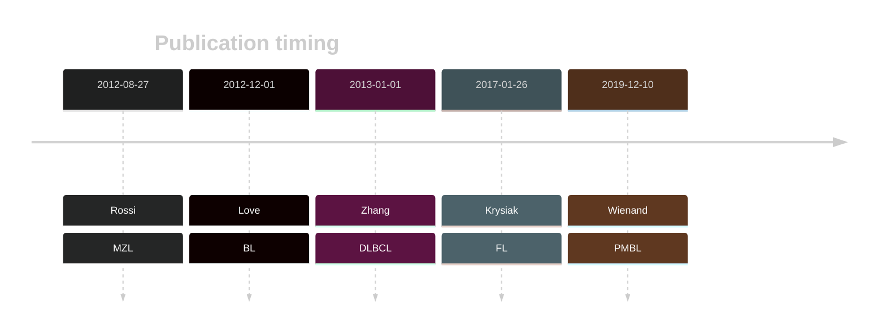
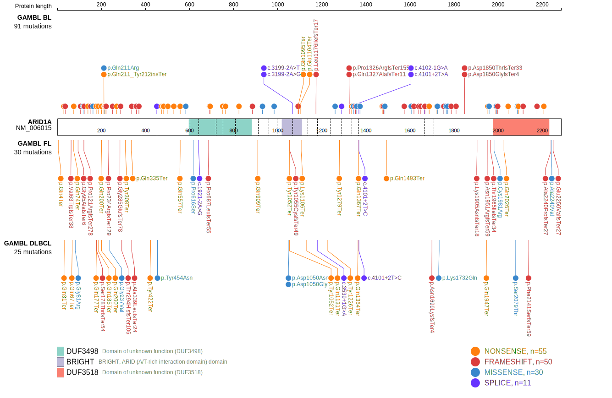
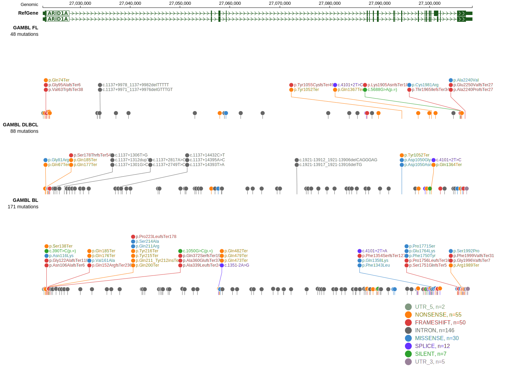
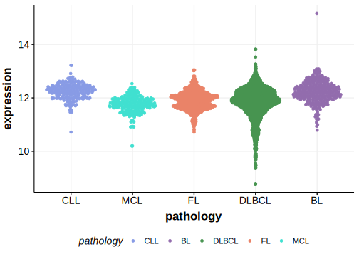

# ARID1A

## Overview
ARID1A (AT-rich interactive domain-containing protein 1A) is a gene that encodes a subunit of the SWI/SNF chromatin remodeling complex, which is involved in regulating DNA accessibility. Mutations in ARID1A are implicated in various cancers, including B-cell lymphomas. They are the most abundant in Burkitt lymphoma but also occur in FL and, to a lesser extent, DLBCL. 

## Relevance tier by entity
|Entity|Tier|Description               |
|:------:|:----:|--------------------------|
||1|high-confidence PMBL/cHL/GZL gene|
||1|high-confidence MZL gene|
|    |1   |high-confidence BL gene   |
| |1   |high-confidence DLBCL gene|
|    |1   |high-confidence FL gene   |
## Mutation incidence in large cohorts

|Entity|source               |frequency (%)|
|:------:|:---------------------:|:-------------:|
|BL    |GAMBL genomes+capture|28.64        |
|BL    |Thomas cohort        |36.00        |
|BL    |Panea cohort         |19.80        |
|DLBCL |GAMBL genomes        | 8.80        |
|DLBCL |Schmitz cohort       | 8.94        |
|DLBCL |Reddy cohort         | 4.40        |
|DLBCL |Chapuy cohort        | 4.27        |
|FL    |GAMBL genomes        |12.47        |

## Mutation pattern and selective pressure estimates

|Entity|aSHM|Significant selection|dN/dS (missense)|dN/dS (nonsense)|
|:------:|:----:|:---------------------:|:----------------:|:----------------:|
|BL    |No  |Yes                  |3.218           |130.201         |
|DLBCL |No  |Yes                  |2.364           | 38.689         |
|FL    |No  |Yes                  |3.794           |248.722         |

View coding variants in ProteinPaint [hg19](https://morinlab.github.io/LLMPP/GAMBL/ARID1A_protein.html)  or [hg38](https://morinlab.github.io/LLMPP/GAMBL/ARID1A_protein_hg38.html)

View all variants in GenomePaint [hg19](https://morinlab.github.io/LLMPP/GAMBL/ARID1A.html)  or [hg38](https://morinlab.github.io/LLMPP/GAMBL/ARID1A_hg38.html)

## ARID1A Expression

<!-- ORIGIN: loveGeneticLandscapeMutations2012 -->
<!-- MZL: rossiCodingGenomeSplenic2012c -->
<!-- DLBCL: zhangGeneticHeterogeneityDiffuse2013 -->
<!-- BL: loveGeneticLandscapeMutations2012 -->
<!-- FL: krysiakRecurrentSomaticMutations2017b -->
<!-- BL: loveGeneticLandscapeMutations2012 -->
## References
1.  Rossi D, Trifonov V, Fangazio M, Bruscaggin A, Rasi S, Spina V, Monti S, Vaisitti T, Arruga F, Famà R, Ciardullo C, Greco M, Cresta S, Piranda D, Holmes A, Fabbri G, Messina M, Rinaldi A, Wang J, Agostinelli C, Piccaluga PP, Lucioni M, Tabbò F, Serra R, Franceschetti S, Deambrogi C, Daniele G, Gattei V, Marasca R, Facchetti F, Arcaini L, Inghirami G, Bertoni F, Pileri SA, Deaglio S, Foà R, Dalla-Favera R, Pasqualucci L, Rabadan R, Gaidano G. The coding genome of splenic marginal zone lymphoma: activation of NOTCH2 and other pathways regulating marginal zone development. J Exp Med. 2012 Aug 27;209(9):1537–1551. PMCID: PMC3428941
2.  Love C, Sun Z, Jima D, Li G, Zhang J, Miles R, Richards KL, Dunphy CH, Choi WWL, Srivastava G, Lugar PL, Rizzieri DA, Lagoo AS, Bernal-Mizrachi L, Mann KP, Flowers CR, Naresh KN, Evens AM, Chadburn A, Gordon LI, Czader MB, Gill JI, Hsi ED, Greenough A, Moffitt AB, McKinney M, Banerjee A, Grubor V, Levy S, Dunson DB, Dave SS. The genetic landscape of mutations in Burkitt lymphoma. Nat Genet. 2012 Dec;44(12):1321–1325. PMCID: PMC3674561
3.  Zhang J, Grubor V, Love CL, Banerjee A, Richards KL, Mieczkowski PA, Dunphy C, Choi W, Au WY, Srivastava G, Lugar PL, Rizzieri DA, Lagoo AS, Bernal-Mizrachi L, Mann KP, Flowers C, Naresh K, Evens A, Gordon LI, Czader M, Gill JI, Hsi ED, Liu Q, Fan A, Walsh K, Jima D, Smith LL, Johnson AJ, Byrd JC, Luftig MA, Ni T, Zhu J, Chadburn A, Levy S, Dunson D, Dave SS. Genetic heterogeneity of diffuse large B-cell lymphoma. 2013 Jan; 
4.  Krysiak K, Gomez F, White BS, Matlock M, Miller CA, Trani L, Fronick CC, Fulton RS, Kreisel F, Cashen AF, Carson KR, Berrien-Elliott MM, Bartlett NL, Griffith M, Griffith OL, Fehniger TA. Recurrent somatic mutations affecting B-cell receptor signaling pathway genes in follicular lymphoma. Blood. 2017 Jan 26;129(4):473–483. PMCID: PMC5270390
5.  Wienand K, Chapuy B, Stewart C, Dunford AJ, Wu D, Kim J, Kamburov A, Wood TR, Cader FZ, Ducar MD, Thorner AR, Nag A, Heubeck AT, Buonopane MJ, Redd RA, Bojarczuk K, Lawton LN, Armand P, Rodig SJ, Fromm JR, Getz G, Shipp MA. Genomic analyses of flow-sorted Hodgkin Reed-Sternberg cells reveal complementary mechanisms of immune evasion. Blood Adv. 2019 Dec 10;3(23):4065–4080. PMCID: PMC6963251
<!-- PMBL: wienandGenomicAnalysesFlowsorted2019b -->
