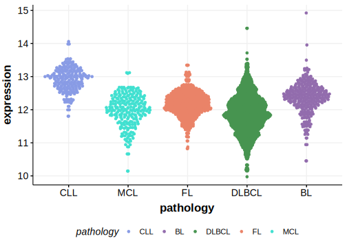

[[_TOC_]]

## Relevance tier by entity

[[include:tables/table1_ARID1B.md]]

## Warnings

<<Warn("The variants reported in this gene in DLBCL failed QC")>>

## Mutation incidence in large patient cohorts (GAMBL reanalysis)

## Mutation incidence in large patient cohorts (GAMBL reanalysis)

### MCL
[[include:tables/MCL_ARID1B.md]]

### DLBCL
[[include:tables/DLBCL_ARID1B.md]]

### FL
[[include:tables/FL_ARID1B.md]]

## Mutation pattern and selective pressure estimates

[[include:tables/dnds_ARID1B.md]]

[[include:browser_ARID1B.md]]

## Expression

## All Mutations

[Reddy_2072T](https://www.bcgsc.ca/downloads/morinlab/GAMBL/Reddy/igv_reports/Reddy_2072T.html)
[Reddy_2076T](https://www.bcgsc.ca/downloads/morinlab/GAMBL/Reddy/igv_reports/Reddy_2076T.html)
[Reddy_2142T](https://www.bcgsc.ca/downloads/morinlab/GAMBL/Reddy/igv_reports/Reddy_2142T.html)
[Reddy_2163T](https://www.bcgsc.ca/downloads/morinlab/GAMBL/Reddy/igv_reports/Reddy_2163T.html)
[Reddy_2217T](https://www.bcgsc.ca/downloads/morinlab/GAMBL/Reddy/igv_reports/Reddy_2217T.html)
[Reddy_2219T](https://www.bcgsc.ca/downloads/morinlab/GAMBL/Reddy/igv_reports/Reddy_2219T.html)
[Reddy_2220T](https://www.bcgsc.ca/downloads/morinlab/GAMBL/Reddy/igv_reports/Reddy_2220T.html)
[Reddy_2228T](https://www.bcgsc.ca/downloads/morinlab/GAMBL/Reddy/igv_reports/Reddy_2228T.html)
[Reddy_2261T](https://www.bcgsc.ca/downloads/morinlab/GAMBL/Reddy/igv_reports/Reddy_2261T.html)
[Reddy_2262T](https://www.bcgsc.ca/downloads/morinlab/GAMBL/Reddy/igv_reports/Reddy_2262T.html)
[Reddy_2298T](https://www.bcgsc.ca/downloads/morinlab/GAMBL/Reddy/igv_reports/Reddy_2298T.html)
[Reddy_2303T](https://www.bcgsc.ca/downloads/morinlab/GAMBL/Reddy/igv_reports/Reddy_2303T.html)
[Reddy_2461T](https://www.bcgsc.ca/downloads/morinlab/GAMBL/Reddy/igv_reports/Reddy_2461T.html)
[Reddy_2464T](https://www.bcgsc.ca/downloads/morinlab/GAMBL/Reddy/igv_reports/Reddy_2464T.html)
[Reddy_2479T](https://www.bcgsc.ca/downloads/morinlab/GAMBL/Reddy/igv_reports/Reddy_2479T.html)
[Reddy_2539T](https://www.bcgsc.ca/downloads/morinlab/GAMBL/Reddy/igv_reports/Reddy_2539T.html)
[Reddy_2562T](https://www.bcgsc.ca/downloads/morinlab/GAMBL/Reddy/igv_reports/Reddy_2562T.html)
[Reddy_2567T](https://www.bcgsc.ca/downloads/morinlab/GAMBL/Reddy/igv_reports/Reddy_2567T.html)
[Reddy_2581T](https://www.bcgsc.ca/downloads/morinlab/GAMBL/Reddy/igv_reports/Reddy_2581T.html)
[Reddy_2624T](https://www.bcgsc.ca/downloads/morinlab/GAMBL/Reddy/igv_reports/Reddy_2624T.html)
[Reddy_2626T](https://www.bcgsc.ca/downloads/morinlab/GAMBL/Reddy/igv_reports/Reddy_2626T.html)
[Reddy_2639T](https://www.bcgsc.ca/downloads/morinlab/GAMBL/Reddy/igv_reports/Reddy_2639T.html)
[Reddy_2643T](https://www.bcgsc.ca/downloads/morinlab/GAMBL/Reddy/igv_reports/Reddy_2643T.html)
[Reddy_2706T](https://www.bcgsc.ca/downloads/morinlab/GAMBL/Reddy/igv_reports/Reddy_2706T.html)
[Reddy_2773T](https://www.bcgsc.ca/downloads/morinlab/GAMBL/Reddy/igv_reports/Reddy_2773T.html)
[Reddy_2775T](https://www.bcgsc.ca/downloads/morinlab/GAMBL/Reddy/igv_reports/Reddy_2775T.html)
[Reddy_2785T](https://www.bcgsc.ca/downloads/morinlab/GAMBL/Reddy/igv_reports/Reddy_2785T.html)
[Reddy_3401T](https://www.bcgsc.ca/downloads/morinlab/GAMBL/Reddy/igv_reports/Reddy_3401T.html)
[Reddy_3412T](https://www.bcgsc.ca/downloads/morinlab/GAMBL/Reddy/igv_reports/Reddy_3412T.html)
[Reddy_3438T](https://www.bcgsc.ca/downloads/morinlab/GAMBL/Reddy/igv_reports/Reddy_3438T.html)
[Reddy_3462T](https://www.bcgsc.ca/downloads/morinlab/GAMBL/Reddy/igv_reports/Reddy_3462T.html)
[Reddy_3467T](https://www.bcgsc.ca/downloads/morinlab/GAMBL/Reddy/igv_reports/Reddy_3467T.html)
[Reddy_3486T](https://www.bcgsc.ca/downloads/morinlab/GAMBL/Reddy/igv_reports/Reddy_3486T.html)
[Reddy_3495T](https://www.bcgsc.ca/downloads/morinlab/GAMBL/Reddy/igv_reports/Reddy_3495T.html)
[Reddy_3496T](https://www.bcgsc.ca/downloads/morinlab/GAMBL/Reddy/igv_reports/Reddy_3496T.html)
[Reddy_3504T](https://www.bcgsc.ca/downloads/morinlab/GAMBL/Reddy/igv_reports/Reddy_3504T.html)
[Reddy_3505T](https://www.bcgsc.ca/downloads/morinlab/GAMBL/Reddy/igv_reports/Reddy_3505T.html)
[Reddy_3528T](https://www.bcgsc.ca/downloads/morinlab/GAMBL/Reddy/igv_reports/Reddy_3528T.html)
[Reddy_3560T](https://www.bcgsc.ca/downloads/morinlab/GAMBL/Reddy/igv_reports/Reddy_3560T.html)
[Reddy_3596T](https://www.bcgsc.ca/downloads/morinlab/GAMBL/Reddy/igv_reports/Reddy_3596T.html)
[Reddy_3609T](https://www.bcgsc.ca/downloads/morinlab/GAMBL/Reddy/igv_reports/Reddy_3609T.html)
[Reddy_3610T](https://www.bcgsc.ca/downloads/morinlab/GAMBL/Reddy/igv_reports/Reddy_3610T.html)
[Reddy_3616T](https://www.bcgsc.ca/downloads/morinlab/GAMBL/Reddy/igv_reports/Reddy_3616T.html)
[Reddy_3638T](https://www.bcgsc.ca/downloads/morinlab/GAMBL/Reddy/igv_reports/Reddy_3638T.html)
[Reddy_3640T](https://www.bcgsc.ca/downloads/morinlab/GAMBL/Reddy/igv_reports/Reddy_3640T.html)
[Reddy_3644T](https://www.bcgsc.ca/downloads/morinlab/GAMBL/Reddy/igv_reports/Reddy_3644T.html)
[Reddy_3647T](https://www.bcgsc.ca/downloads/morinlab/GAMBL/Reddy/igv_reports/Reddy_3647T.html)
[Reddy_3652T](https://www.bcgsc.ca/downloads/morinlab/GAMBL/Reddy/igv_reports/Reddy_3652T.html)
[Reddy_3655T](https://www.bcgsc.ca/downloads/morinlab/GAMBL/Reddy/igv_reports/Reddy_3655T.html)
[Reddy_3660T](https://www.bcgsc.ca/downloads/morinlab/GAMBL/Reddy/igv_reports/Reddy_3660T.html)
[Reddy_3663T](https://www.bcgsc.ca/downloads/morinlab/GAMBL/Reddy/igv_reports/Reddy_3663T.html)
[Reddy_3679T](https://www.bcgsc.ca/downloads/morinlab/GAMBL/Reddy/igv_reports/Reddy_3679T.html)
[Reddy_3686T](https://www.bcgsc.ca/downloads/morinlab/GAMBL/Reddy/igv_reports/Reddy_3686T.html)
[Reddy_3687T](https://www.bcgsc.ca/downloads/morinlab/GAMBL/Reddy/igv_reports/Reddy_3687T.html)
[Reddy_3707T](https://www.bcgsc.ca/downloads/morinlab/GAMBL/Reddy/igv_reports/Reddy_3707T.html)
[Reddy_3708T](https://www.bcgsc.ca/downloads/morinlab/GAMBL/Reddy/igv_reports/Reddy_3708T.html)
[Reddy_3715T](https://www.bcgsc.ca/downloads/morinlab/GAMBL/Reddy/igv_reports/Reddy_3715T.html)
[Reddy_3725T](https://www.bcgsc.ca/downloads/morinlab/GAMBL/Reddy/igv_reports/Reddy_3725T.html)
[Reddy_3726T](https://www.bcgsc.ca/downloads/morinlab/GAMBL/Reddy/igv_reports/Reddy_3726T.html)
[Reddy_3732T](https://www.bcgsc.ca/downloads/morinlab/GAMBL/Reddy/igv_reports/Reddy_3732T.html)
[Reddy_3740T](https://www.bcgsc.ca/downloads/morinlab/GAMBL/Reddy/igv_reports/Reddy_3740T.html)
[Reddy_3764T](https://www.bcgsc.ca/downloads/morinlab/GAMBL/Reddy/igv_reports/Reddy_3764T.html)
[Reddy_3811T](https://www.bcgsc.ca/downloads/morinlab/GAMBL/Reddy/igv_reports/Reddy_3811T.html)
[Reddy_3832T](https://www.bcgsc.ca/downloads/morinlab/GAMBL/Reddy/igv_reports/Reddy_3832T.html)
[Reddy_3886T](https://www.bcgsc.ca/downloads/morinlab/GAMBL/Reddy/igv_reports/Reddy_3886T.html)
[Reddy_3898T](https://www.bcgsc.ca/downloads/morinlab/GAMBL/Reddy/igv_reports/Reddy_3898T.html)
[Reddy_3921T](https://www.bcgsc.ca/downloads/morinlab/GAMBL/Reddy/igv_reports/Reddy_3921T.html)
[Reddy_3923T](https://www.bcgsc.ca/downloads/morinlab/GAMBL/Reddy/igv_reports/Reddy_3923T.html)
[Reddy_3935T](https://www.bcgsc.ca/downloads/morinlab/GAMBL/Reddy/igv_reports/Reddy_3935T.html)
[Reddy_3939T](https://www.bcgsc.ca/downloads/morinlab/GAMBL/Reddy/igv_reports/Reddy_3939T.html)
[Reddy_3941T](https://www.bcgsc.ca/downloads/morinlab/GAMBL/Reddy/igv_reports/Reddy_3941T.html)
[Reddy_3944T](https://www.bcgsc.ca/downloads/morinlab/GAMBL/Reddy/igv_reports/Reddy_3944T.html)
[Reddy_3967T](https://www.bcgsc.ca/downloads/morinlab/GAMBL/Reddy/igv_reports/Reddy_3967T.html)
[Reddy_3979T](https://www.bcgsc.ca/downloads/morinlab/GAMBL/Reddy/igv_reports/Reddy_3979T.html)
[Reddy_3980T](https://www.bcgsc.ca/downloads/morinlab/GAMBL/Reddy/igv_reports/Reddy_3980T.html)
[Reddy_3986T](https://www.bcgsc.ca/downloads/morinlab/GAMBL/Reddy/igv_reports/Reddy_3986T.html)
[Reddy_816T](https://www.bcgsc.ca/downloads/morinlab/GAMBL/Reddy/igv_reports/Reddy_816T.html)
[Reddy_823T](https://www.bcgsc.ca/downloads/morinlab/GAMBL/Reddy/igv_reports/Reddy_823T.html)

<!-- ORIGIN: reddyGeneticFunctionalDrivers2017 -->
<!-- DLBCL: reddyGeneticFunctionalDrivers2017 -->

[[include:tables/mermaid_ARID1B.md]]

## References
