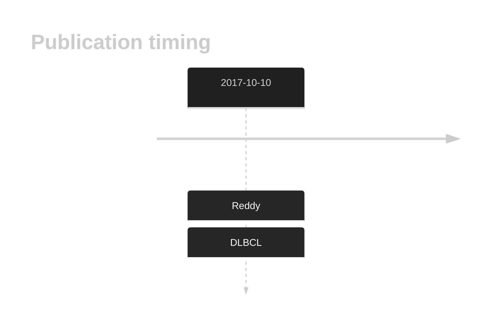

# ARID1B

<<Warn("The variants reported in this gene in DLBCL failed QC")>>

## History

## Relevance tier by entity

|Entity|Tier|Description                              |
|:------:|:----:|-----------------------------------------|
| |2-F   |failed QC[@reddyGeneticFunctionalDrivers2017]|
|   |2   |relevance in MCL not firmly established  |

## Mutation incidence in large patient cohorts (GAMBL reanalysis)

|Entity|source        |frequency (%)|
|:------:|:--------------:|:-------------:|
|DLBCL |GAMBL genomes |5.16         |
|DLBCL |Schmitz cohort|5.96         |
|DLBCL |Reddy cohort  |3.30         |
|DLBCL |Chapuy cohort |2.14         |
|MCL   |GAMBL genomes |1.90         |

## Mutation pattern and selective pressure estimates

|Entity|aSHM|Significant selection|dN/dS (missense)|dN/dS (nonsense)|
|:------:|:----:|:---------------------:|:----------------:|:----------------:|
|BL    |No  |No                   |0.659           | 4.236          |
|DLBCL |No  |No                   |0.969           |13.782          |
|FL    |No  |No                   |0.747           |11.009          |

View coding variants in ProteinPaint [hg19](https://morinlab.github.io/LLMPP/GAMBL/ARID1B_protein.html)  or [hg38](https://morinlab.github.io/LLMPP/GAMBL/ARID1B_protein_hg38.html)

View all variants in GenomePaint [hg19](https://morinlab.github.io/LLMPP/GAMBL/ARID1B.html)  or [hg38](https://morinlab.github.io/LLMPP/GAMBL/ARID1B_hg38.html)

## ARID1B Expression

<!-- ORIGIN: reddyGeneticFunctionalDrivers2017 -->
<!-- DLBCL: reddyGeneticFunctionalDrivers2017 -->

## References
