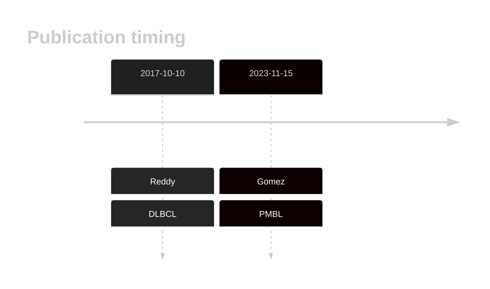

# ARID5B

<<Warn("In a subsequent reanalysis, the mutation rate in this gene was found to be inflated in the original results")>>

## Relevance tier by entity

|Entity|Tier|Description                              |
|:------:|:----:|-----------------------------------------|
||1|high-confidence PMBL/cHL/GZL gene[@gomezUltraDeepSequencingReveals2023]|
| |2   |relevance in DLBCL not firmly established[@reddyGeneticFunctionalDrivers2017;@drevalRevisitingReddyDLBCL2023]|

## Mutation incidence in large patient cohorts (GAMBL reanalysis)

|Entity|source        |frequency (%)|
|:------:|:--------------:|:-------------:|
|DLBCL |GAMBL genomes |3.25         |
|DLBCL |Schmitz cohort|4.30         |
|DLBCL |Reddy cohort  |4.30         |
|DLBCL |Chapuy cohort |2.60         |

## Mutation pattern and selective pressure estimates

|Entity|aSHM|Significant selection|dN/dS (missense)|dN/dS (nonsense)|
|:------:|:----:|:---------------------:|:----------------:|:----------------:|
|BL    |No  |No                   |0.378           |0               |
|DLBCL |No  |No                   |2.263           |0               |
|FL    |No  |No                   |0.000           |0               |

View coding variants in ProteinPaint [hg19](https://morinlab.github.io/LLMPP/GAMBL/ARID5B_protein.html)  or [hg38](https://morinlab.github.io/LLMPP/GAMBL/ARID5B_protein_hg38.html)

View all variants in GenomePaint [hg19](https://morinlab.github.io/LLMPP/GAMBL/ARID5B.html)  or [hg38](https://morinlab.github.io/LLMPP/GAMBL/ARID5B_hg38.html)

## ARID5B Expression

## Representative Mutations

**Rating**
&starf; &starf; &starf; &starf; &star;

**Rating**
&starf; &starf; &starf; &starf; &star;

## References

<!-- ORIGIN: reddyGeneticFunctionalDrivers2017 -->
<!-- PMBL: gomezUltraDeepSequencingReveals2023 -->
<!-- DLBCL: reddyGeneticFunctionalDrivers2017 -->
