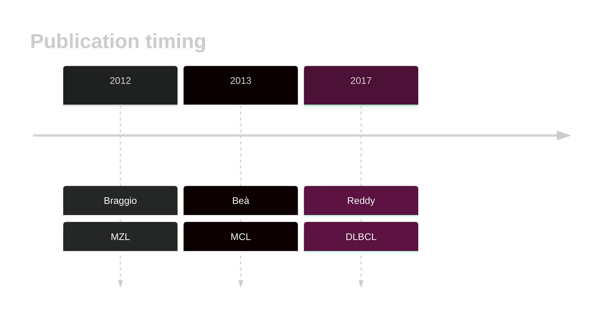

# ATM

## History
Mutations in this gene were first described in MZL by Braggio et al,1 then in MCL by Bea et al.2 ATM mutations were later described in DLBCL by Reddy et al.3

## Relevance tier by entity

|Entity|Tier|Description               |
|:------:|:----:|--------------------------|
||1|high-confidence MZL gene[@braggioGenomicAnalysisMarginal2012]|
| |1   |high-confidence DLBCL gene[@reddyGeneticFunctionalDrivers2017]|
|   |1   |high-confidence MCL gene  [@beaLandscapeSomaticMutations2013]|

## Mutation incidence in large patient cohorts (GAMBL reanalysis)

|Entity|source        |frequency (%)|
|:------:|:--------------:|:-------------:|
|DLBCL |GAMBL genomes | 6.88        |
|DLBCL |Schmitz cohort| 5.53        |
|DLBCL |Reddy cohort  | 5.91        |
|DLBCL |Chapuy cohort | 4.70        |
|MCL   |GAMBL genomes |45.02        |

## Mutation pattern and selective pressure estimates

|Entity|aSHM|Significant selection|dN/dS (missense)|dN/dS (nonsense)|
|:------:|:----:|:---------------------:|:----------------:|:----------------:|
|BL    |No  |No                   |2.461           |0.000           |
|DLBCL |No  |No                   |3.529           |5.446           |
|FL    |No  |No                   |1.679           |6.201           |

View coding variants in ProteinPaint [hg19](https://morinlab.github.io/LLMPP/GAMBL/ATM_protein.html)  or [hg38](https://morinlab.github.io/LLMPP/GAMBL/ATM_protein_hg38.html)

View all variants in GenomePaint [hg19](https://morinlab.github.io/LLMPP/GAMBL/ATM.html)  or [hg38](https://morinlab.github.io/LLMPP/GAMBL/ATM_hg38.html)

## ATM Expression

## References

<!-- ORIGIN: braggioGenomicAnalysisMarginal2012 -->
<!-- DLBCL: reddyGeneticFunctionalDrivers2017 -->
<!-- MZL: braggioGenomicAnalysisMarginal2012 -->
<!-- MCL: beaLandscapeSomaticMutations2013 -->
