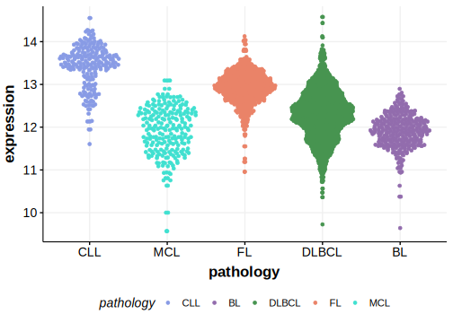

[[_TOC_]]

## Overview

Mutations in this gene were first described in MZL by Braggio et al.[@braggioGenomicAnalysisMarginal2012] then in MCL by Bea et al.[@beaLandscapeSomaticMutations2013] ATM mutations were later described in DLBCL by Reddy et al.[@reddyGeneticFunctionalDrivers2017]
Although there is [experimental data](#experimental-evidence) supporting its relevance in MCL, the role of ATM in DLBCL remains unclear.
[Selective pressure analysis](#mutation-pattern-and-selective-pressure-estimates) did not identify this gene as significantly enriched for either missense or truncating mutations, indicating that many of these mutations may represent passengers. 

## Experimental Evidence

Driver mutations affecting this gene in MCL have been experimentally demonstrated to cause a reduction or loss of function (LOF).[@camachoATMGeneInactivation2002]

## Relevance tier by entity

[[include:tables/table1_ATM.md]]

## Mutation incidence in large patient cohorts (GAMBL reanalysis)

### MCL
[[include:tables/MCL_ATM]]

### DLBCL
[[include:tables/DLBCL_ATM.md]]

### BL
[[include:tables/BL_ATM.md]]

### FL
[[include:tables/FL_ATM.md]]

## Mutation pattern and selective pressure estimates

[[include:tables/dnds_ATM.md]]

[[include:tables/browser_ATM.md]]

## Expression

[[include:tables/mermaid_ATM.md]]

## References

<!-- ORIGIN: braggioGenomicAnalysisMarginal2012 -->
<!-- DLBCL: reddyGeneticFunctionalDrivers2017 -->
<!-- MZL: braggioGenomicAnalysisMarginal2012 -->
<!-- MCL: beaLandscapeSomaticMutations2013 -->
