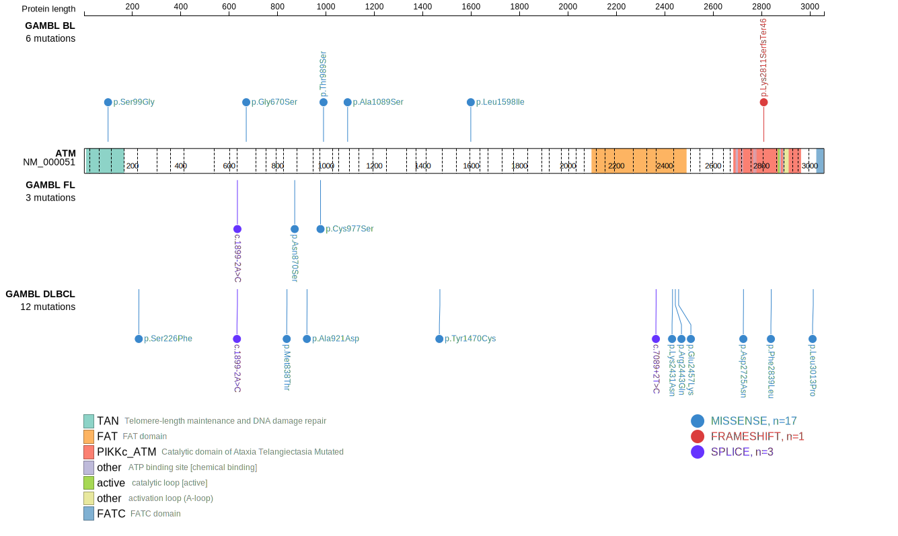
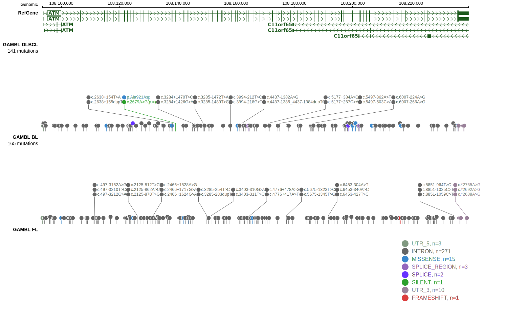

# ATM

## Relevance tier by entity

|Entity|Tier|Description               |
|:------:|:----:|--------------------------|
|DLBCL |1   |high-confidence DLBCL gene|
|MCL   |1   |high-confidence MCL gene  |

## Mutation incidence in large patient cohorts (GAMBL reanalysis)

|Entity|source        |frequency (%)|
|:------:|:--------------:|:-------------:|
|DLBCL |GAMBL genomes | 6.88        |
|DLBCL |Schmitz cohort| 5.53        |
|DLBCL |Reddy cohort  | 5.91        |
|DLBCL |Chapuy cohort | 4.70        |
|MCL   |GAMBL genomes |45.02        |

## Mutation pattern and selective pressure estimates

|Entity|aSHM|Significant selection|dN/dS (missense)|dN/dS (nonsense)|
|:------:|:----:|:---------------------:|:----------------:|:----------------:|
|BL    |No  |No                   |2.461           |0.000           |
|DLBCL |No  |No                   |3.529           |5.446           |
|FL    |No  |No                   |1.679           |6.201           |

> [!NOTE]
> First described in DLBCL in 2017 by [Reddy A](https://pubmed.ncbi.nlm.nih.gov/28985567). First described in MCL in 2013 by [Beà S](https://pubmed.ncbi.nlm.nih.gov/24145436)

View coding variants in ProteinPaint [hg19](https://morinlab.github.io/LLMPP/GAMBL/ATM_protein.html)  or [hg38](https://morinlab.github.io/LLMPP/GAMBL/ATM_protein_hg38.html)

View all variants in GenomePaint [hg19](https://morinlab.github.io/LLMPP/GAMBL/ATM.html)  or [hg38](https://morinlab.github.io/LLMPP/GAMBL/ATM_hg38.html)

