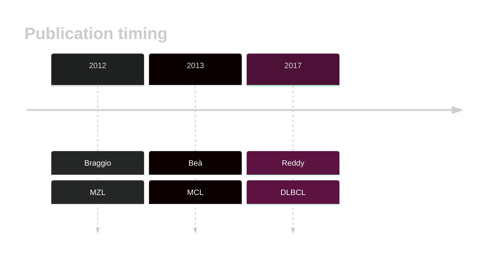

# ATM
## History
Mutations in this gene were first described in MZL by Braggio et al,1 then in MCL by Bea et al.2 ATM mutations were later described in DLBCL by Reddy et al.3

## Relevance tier by entity

|Entity|Tier|Description               |
|:------:|:----:|--------------------------|
||1|high-confidence MZL gene|
| |1   |high-confidence DLBCL gene|
|   |1   |high-confidence MCL gene  |

## Mutation incidence in large patient cohorts (GAMBL reanalysis)

|Entity|source        |frequency (%)|
|:------:|:--------------:|:-------------:|
|DLBCL |GAMBL genomes | 6.88        |
|DLBCL |Schmitz cohort| 5.53        |
|DLBCL |Reddy cohort  | 5.91        |
|DLBCL |Chapuy cohort | 4.70        |
|MCL   |GAMBL genomes |45.02        |

## Mutation pattern and selective pressure estimates

|Entity|aSHM|Significant selection|dN/dS (missense)|dN/dS (nonsense)|
|:------:|:----:|:---------------------:|:----------------:|:----------------:|
|BL    |No  |No                   |2.461           |0.000           |
|DLBCL |No  |No                   |3.529           |5.446           |
|FL    |No  |No                   |1.679           |6.201           |

View coding variants in ProteinPaint [hg19](https://morinlab.github.io/LLMPP/GAMBL/ATM_protein.html)  or [hg38](https://morinlab.github.io/LLMPP/GAMBL/ATM_protein_hg38.html)

View all variants in GenomePaint [hg19](https://morinlab.github.io/LLMPP/GAMBL/ATM.html)  or [hg38](https://morinlab.github.io/LLMPP/GAMBL/ATM_hg38.html)

## ATM Expression

## References
1. *Braggio E, Dogan A, Keats JJ, Chng WJ, Huang G, Matthews JM, Maurer MJ, Law ME, Bosler DS, Barrett M, Lossos IS, Witzig TE, Fonseca R. Genomic analysis of marginal zone and lymphoplasmacytic lymphomas identified common and disease-specific abnormalities. Mod Pathol. 2012 May;25(5):651–660. PMCID: PMC3341516*
2.  *Beà S, Valdés-Mas R, Navarro A, Salaverria I, Martín-Garcia D, Jares P, Giné E, Pinyol M, Royo C, Nadeu F, Conde L, Juan M, Clot G, Vizán P, Croce LD, Puente DA, López-Guerra M, Moros A, Roue G, Aymerich M, Villamor N, Colomo L, Martínez A, Valera A, Martín-Subero JI, Amador V, Hernández L, Rozman M, Enjuanes A, Forcada P, Muntañola A, Hartmann EM, Calasanz MJ, Rosenwald A, Ott G, Hernández-Rivas JM, Klapper W, Siebert R, Wiestner A, Wilson WH, Colomer D, López-Guillermo A, López-Otín C, Puente XS, Campo E. Landscape of somatic mutations and clonal evolution in mantle cell lymphoma. PNAS. 2013 Nov 5;110(45):18250–18255. PMID: 24145436*
3.  *Reddy A, Zhang J, Davis NS, Moffitt AB, Love CL, Waldrop A, Leppa S, Pasanen A, Meriranta L, Karjalainen-Lindsberg ML, Nørgaard P, Pedersen M, Gang AO, Høgdall E, Heavican TB, Lone W, Iqbal J, Qin Q, Li G, Kim SY, Healy J, Richards KL, Fedoriw Y, Bernal-Mizrachi L, Koff JL, Staton AD, Flowers CR, Paltiel O, Goldschmidt N, Calaminici M, Clear A, Gribben J, Nguyen E, Czader MB, Ondrejka SL, Collie A, Hsi ED, Tse E, Au-Yeung RKH, Kwong YL, Srivastava G, Choi WWL, Evens AM, Pilichowska M, Sengar M, Reddy N, Li S, Chadburn A, Gordon LI, Jaffe ES, Levy S, Rempel R, Tzeng T, Happ LE, Dave T, Rajagopalan D, Datta J, Dunson DB, Dave SS. Genetic and Functional Drivers of Diffuse Large B Cell Lymphoma. Cell. 2017 Oct;171(2):481-494.e15.* 

<!-- ORIGIN: braggioGenomicAnalysisMarginal2012 -->
<!-- DLBCL: reddyGeneticFunctionalDrivers2017 -->
<!-- MZL: braggioGenomicAnalysisMarginal2012 -->
<!-- MCL: beaLandscapeSomaticMutations2013 -->
