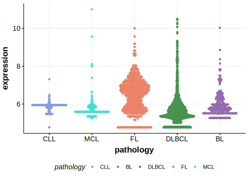

[[_TOC_]]

## Overview

Due to [minimal support](ATP2C2#representative-mutation) in the original primary data and very few mutations reported in subsequent studies, this gene is very unlikely to be relevant in BL. 

## Relevance tier by entity

|Entity|Tier|Description                           |
|:------:|:----:|--------------------------------------|
|    |3   |Retired, Failed QC[@loveGeneticLandscapeMutations2012]|

## Warnings

<<Warn("The variants reported in this gene in BL failed QC")>>

## Mutation incidence in large patient cohorts (GAMBL reanalysis)

|Entity|source               |frequency (%)|
|:------:|:---------------------:|:-------------:|
|BL    |GAMBL genomes+capture|3.7          |
|BL    |Thomas cohort        | NA          |
|BL    |Panea cohort         | NA          |

## Mutation pattern and selective pressure estimates

[[include:dnds_ATP2C2.md]]

[[include:browser_ATP2C2.md]]

## Expression

<!-- ORIGIN: loveGeneticLandscapeMutations2012 -->
<!-- BL: loveGeneticLandscapeMutations2012 -->

## Representative Mutation 

**Rating**
&starf; &starf; &star; &star; &star;

## All Mutations

[1102](https://www.bcgsc.ca/downloads/morinlab/GAMBL/Love/1102_reports.html)
[667](https://www.bcgsc.ca/downloads/morinlab/GAMBL/Love/667_reports.html)
[677](https://www.bcgsc.ca/downloads/morinlab/GAMBL/Love/677_reports.html)

[[include:mermaid_ATP2C2.md]]

## References
