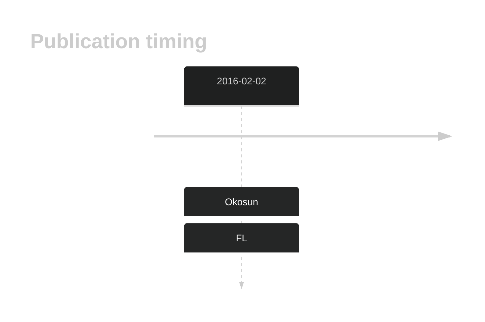

# ATP6AP1
## History

## Relevance tier by entity

|Entity|Tier|Description            |
|:------:|:----:|-----------------------|
|    |1   |high-confidence FL gene|

## Mutation incidence in large patient cohorts (GAMBL reanalysis)

|Entity|source       |frequency (%)|
|:------:|:-------------:|:-------------:|
|FL    |GAMBL genomes|4.85         |

## Mutation pattern and selective pressure estimates

|Entity|aSHM|Significant selection|dN/dS (missense)|dN/dS (nonsense)|
|:------:|:----:|:---------------------:|:----------------:|:----------------:|
|BL    |No  |No                   | 0.000          | 0.000          |
|DLBCL |No  |No                   | 0.000          | 0.000          |
|FL    |No  |Yes                  |50.635          |72.487          |

View coding variants in ProteinPaint [hg19](https://morinlab.github.io/LLMPP/GAMBL/ATP6AP1_protein.html)  or [hg38](https://morinlab.github.io/LLMPP/GAMBL/ATP6AP1_protein_hg38.html)

View all variants in GenomePaint [hg19](https://morinlab.github.io/LLMPP/GAMBL/ATP6AP1.html)  or [hg38](https://morinlab.github.io/LLMPP/GAMBL/ATP6AP1_hg38.html)

## ATP6AP1 Expression

<!-- ORIGIN: okosunRecurrentMTORC1activatingRRAGC2016a -->
<!-- FL: okosunRecurrentMTORC1activatingRRAGC2016a -->
## References
1.  Okosun J, Wolfson RL, Wang J, Araf S, Wilkins L, Castellano BM, Escudero-Ibarz L, Al Seraihi AF, Richter J, Bernhart SH, Efeyan A, Iqbal S, Matthews J, Clear A, Guerra-Assunção JA, Bödör C, Quentmeier H, Mansbridge C, Johnson P, Davies A, Strefford JC, Packham G, Barrans S, Jack A, Du MQ, Calaminici M, Lister TA, Auer R, Montoto S, Gribben JG, Siebert R, Chelala C, Zoncu R, Sabatini DM, Fitzgibbon J. Recurrent mTORC1-activating RRAGC mutations in follicular lymphoma. Nat Genet. 2016 Feb;48(2):183–188. PMCID: PMC4731318
