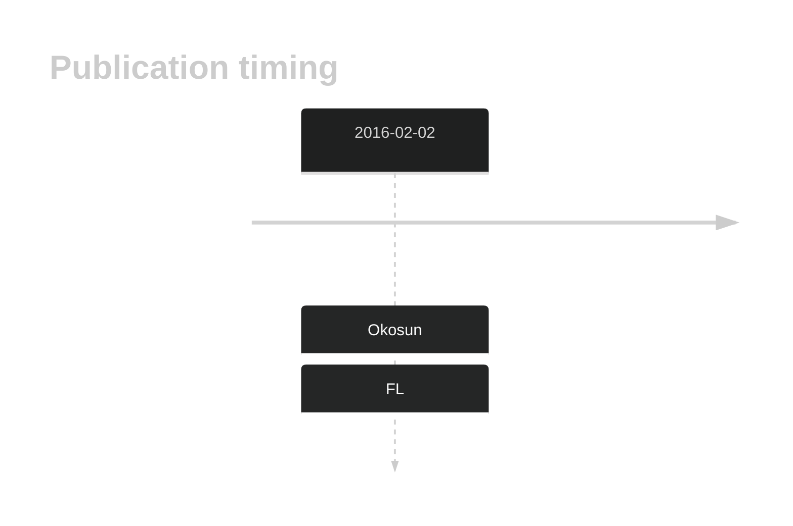
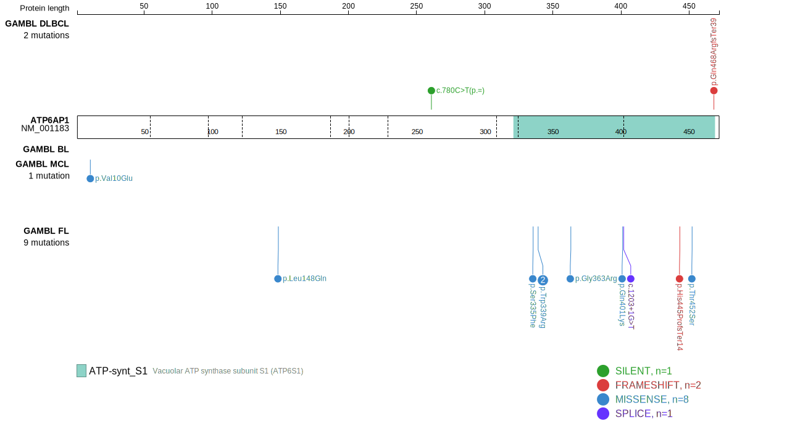
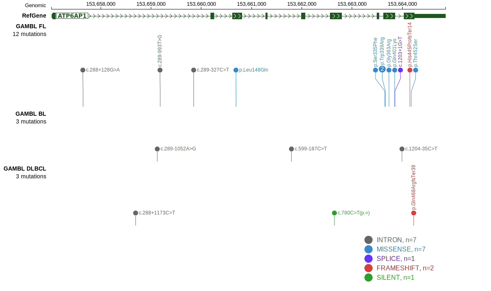
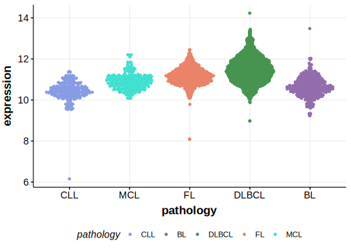

# ATP6AP1

## History

## Relevance tier by entity

|Entity|Tier|Description            |
|:------:|:----:|-----------------------|
|    |1   |high-confidence FL gene[@okosunRecurrentMTORC1activatingRRAGC2016]|

## Mutation incidence in large patient cohorts (GAMBL reanalysis)

[[include:FL_ATP6AP1.md]]

## Mutation pattern and selective pressure estimates

|Entity|aSHM|Significant selection|dN/dS (missense)|dN/dS (nonsense)|
|:------:|:----:|:---------------------:|:----------------:|:----------------:|
|BL    |No  |No                   | 0.000          | 0.000          |
|DLBCL |No  |No                   | 0.000          | 0.000          |
|FL    |No  |Yes                  |50.635          |72.487          |

View coding variants in ProteinPaint [hg19](https://morinlab.github.io/LLMPP/GAMBL/ATP6AP1_protein.html)  or [hg38](https://morinlab.github.io/LLMPP/GAMBL/ATP6AP1_protein_hg38.html)

View all variants in GenomePaint [hg19](https://morinlab.github.io/LLMPP/GAMBL/ATP6AP1.html)  or [hg38](https://morinlab.github.io/LLMPP/GAMBL/ATP6AP1_hg38.html)

## ATP6AP1 Expression

<!-- ORIGIN: okosunRecurrentMTORC1activatingRRAGC2016a -->
<!-- FL: okosunRecurrentMTORC1activatingRRAGC2016a -->

## References
