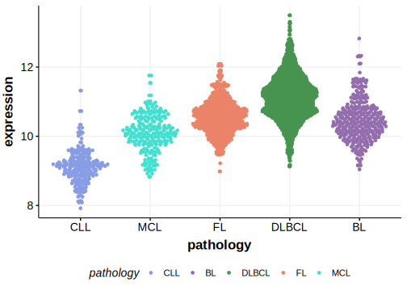

[[_TOC_]]

Mutations in this gene were first described in DLBCL in 2021 by Hübschmann et al.1

## Relevance tier by entity

|Entity|Tier|Description                           |
|:------:|:----:|--------------------------------------|
|    |2   |relevance in FL not firmly established[@hubschmannMutationalMechanismsShaping2021]|

## Mutation incidence in large patient cohorts (GAMBL reanalysis)

|Entity|source       |frequency (%)|
|:------:|:-------------:|:-------------:|
|FL    |GAMBL genomes|1.15         |

## Mutation pattern and selective pressure estimates

[[include:dnds_ATP6V1A.md]]

## ATP6V1A Hotspots

| Chromosome |Coordinate (hg19) | ref>alt | HGVSp | 
 | :---:| :---: | :--: | :---: |
| chr3 | 113528218 | G>A | D600N |

[[include:browser_ATP6V1A.md]]

## Expression

## All Mutations

[SP59304](https://www.bcgsc.ca/downloads/morinlab/GAMBL/MALY/SP59304.html)
[SP59444](https://www.bcgsc.ca/downloads/morinlab/GAMBL/MALY/SP59444.html)
[SP193057](https://www.bcgsc.ca/downloads/morinlab/GAMBL/MALY/SP193057.html)
[SP194216](https://www.bcgsc.ca/downloads/morinlab/GAMBL/MALY/SP194216.html)

[[include:mermaid_ATP6V1A.md]]

## References

<!-- ORIGIN: hubschmannMutationalMechanismsShaping2021b -->
<!-- FL: hubschmannMutationalMechanismsShaping2021b -->
