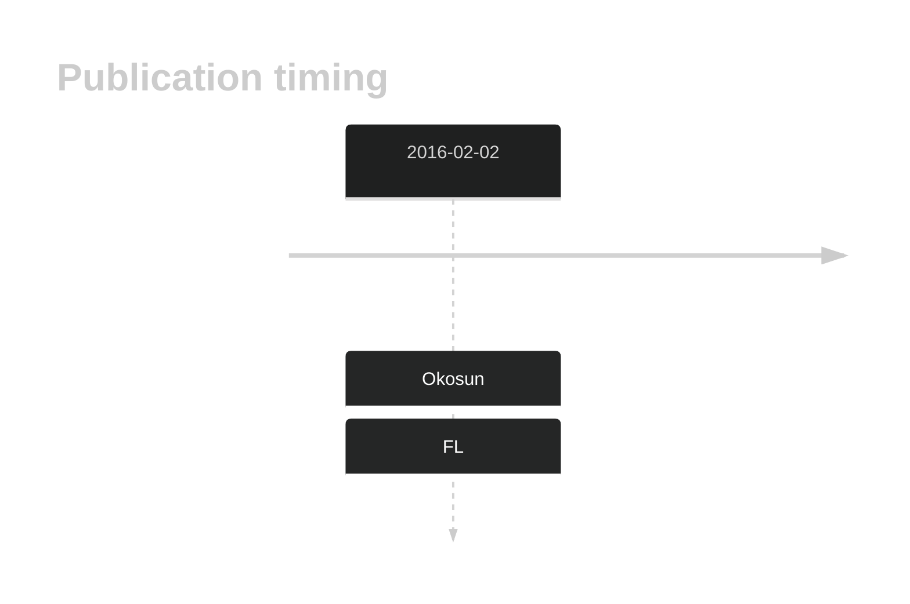
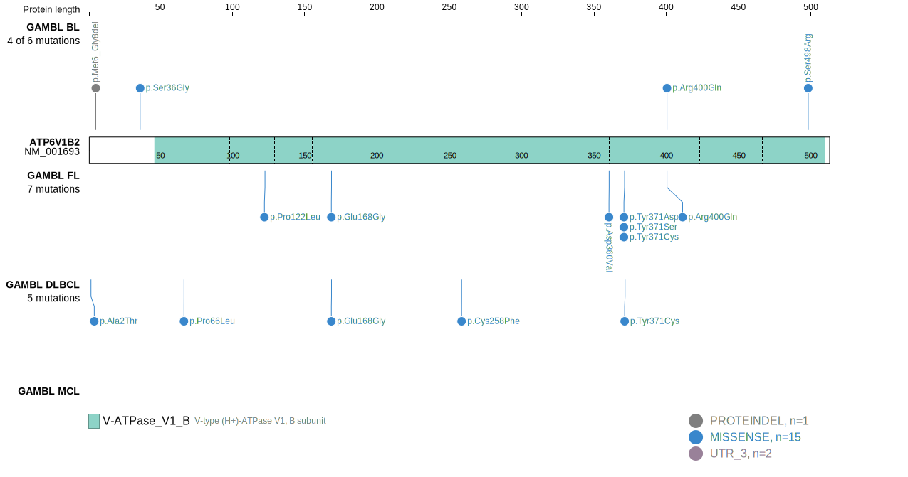
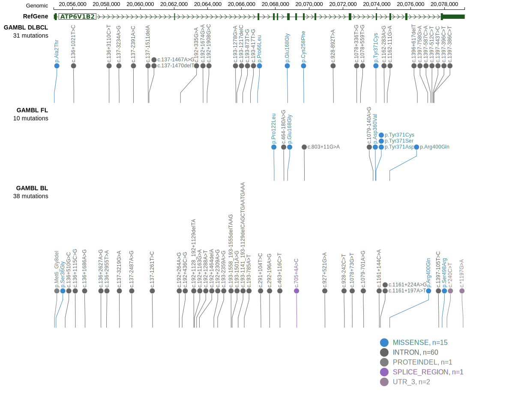
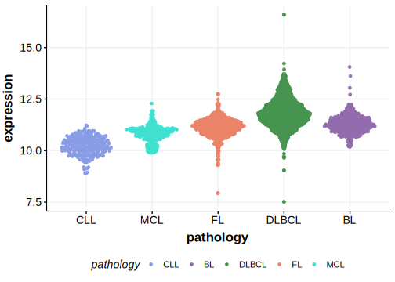

# ATP6V1B2

## History

## Relevance tier by entity

|Entity|Tier|Description            |
|:------:|:----:|-----------------------|
|    |1   |high-confidence FL gene[@okosunRecurrentMTORC1activatingRRAGC2016]|

## Mutation incidence in large patient cohorts (GAMBL reanalysis)

[[include:FL_ATP6V1B2.md]]

## Mutation pattern and selective pressure estimates

|Entity|aSHM|Significant selection|dN/dS (missense)|dN/dS (nonsense)|
|:------:|:----:|:---------------------:|:----------------:|:----------------:|
|BL    |No  |No                   | 5.989          |0               |
|DLBCL |No  |No                   | 1.297          |0               |
|FL    |No  |Yes                  |72.658          |0               |

## ATP6V1B2 Hotspots

| Chromosome |Coordinate (hg19) | ref>alt | HGVSp | 
 | :---:| :---: | :--: | :---: |
| chr8 | 20074768 | G>A | R400Q |

View coding variants in ProteinPaint [hg19](https://morinlab.github.io/LLMPP/GAMBL/ATP6V1B2_protein.html)  or [hg38](https://morinlab.github.io/LLMPP/GAMBL/ATP6V1B2_protein_hg38.html)

View all variants in GenomePaint [hg19](https://morinlab.github.io/LLMPP/GAMBL/ATP6V1B2.html)  or [hg38](https://morinlab.github.io/LLMPP/GAMBL/ATP6V1B2_hg38.html)

## ATP6V1B2 Expression

<!-- ORIGIN: okosunRecurrentMTORC1activatingRRAGC2016a -->
<!-- FL: okosunRecurrentMTORC1activatingRRAGC2016a -->

## References
