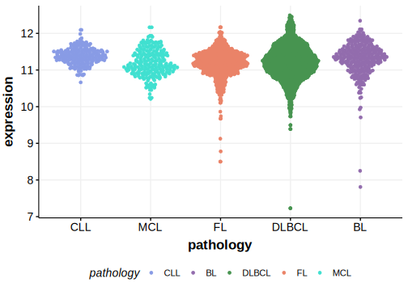
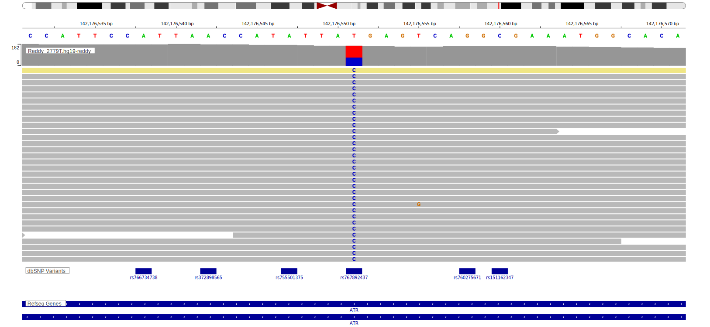
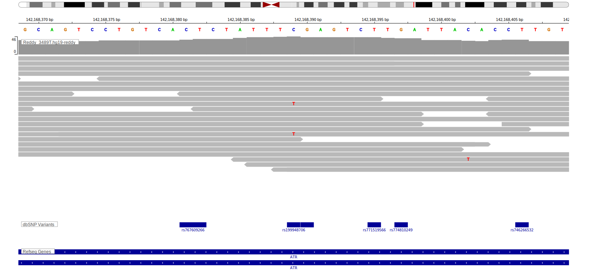

[[_TOC_]]

## Overview

Mutations in this gene were first described in DLBCL in 2017 by Reddy et al.[@reddyGeneticFunctionalDrivers2017] Subsequent exome and genome-wide studies of DLBCL did not reproduce this observation. 

## Relevance tier by entity

[[include:tables/table1_ATR.md]]

## Mutation incidence in large patient cohorts (GAMBL reanalysis)

|Entity|source        |frequency (%)|
|:------:|:--------------:|:-------------:|
|DLBCL |GAMBL genomes |2.68         |
|DLBCL |Schmitz cohort|4.89         |
|DLBCL |Reddy cohort  |2.80         |
|DLBCL |Chapuy cohort |3.85         |

## Mutation pattern and selective pressure estimates

[[include:tables/dnds_ATR.md]]

[[include:browser_ATR.md]]

## Expression

## Representative Mutations

**Rating**
&starf; &starf; &starf; &starf; &starf;

**Rating**
&starf; &starf; &star; &star; &star;

## All Mutations

[Reddy_2121T](https://www.bcgsc.ca/downloads/morinlab/GAMBL/Reddy/igv_reports/Reddy_2121T.html)
[Reddy_2150T](https://www.bcgsc.ca/downloads/morinlab/GAMBL/Reddy/igv_reports/Reddy_2150T.html)
[Reddy_2163T](https://www.bcgsc.ca/downloads/morinlab/GAMBL/Reddy/igv_reports/Reddy_2163T.html)
[Reddy_2192T](https://www.bcgsc.ca/downloads/morinlab/GAMBL/Reddy/igv_reports/Reddy_2192T.html)
[Reddy_2195T](https://www.bcgsc.ca/downloads/morinlab/GAMBL/Reddy/igv_reports/Reddy_2195T.html)
[Reddy_2206T](https://www.bcgsc.ca/downloads/morinlab/GAMBL/Reddy/igv_reports/Reddy_2206T.html)
[Reddy_2236T](https://www.bcgsc.ca/downloads/morinlab/GAMBL/Reddy/igv_reports/Reddy_2236T.html)
[Reddy_2475T](https://www.bcgsc.ca/downloads/morinlab/GAMBL/Reddy/igv_reports/Reddy_2475T.html)
[Reddy_2476T](https://www.bcgsc.ca/downloads/morinlab/GAMBL/Reddy/igv_reports/Reddy_2476T.html)
[Reddy_2585T](https://www.bcgsc.ca/downloads/morinlab/GAMBL/Reddy/igv_reports/Reddy_2585T.html)
[Reddy_2594T](https://www.bcgsc.ca/downloads/morinlab/GAMBL/Reddy/igv_reports/Reddy_2594T.html)
[Reddy_2758T](https://www.bcgsc.ca/downloads/morinlab/GAMBL/Reddy/igv_reports/Reddy_2758T.html)
[Reddy_2768T](https://www.bcgsc.ca/downloads/morinlab/GAMBL/Reddy/igv_reports/Reddy_2768T.html)
[Reddy_2775T](https://www.bcgsc.ca/downloads/morinlab/GAMBL/Reddy/igv_reports/Reddy_2775T.html)
[Reddy_2779T](https://www.bcgsc.ca/downloads/morinlab/GAMBL/Reddy/igv_reports/Reddy_2779T.html)
[Reddy_2805T](https://www.bcgsc.ca/downloads/morinlab/GAMBL/Reddy/igv_reports/Reddy_2805T.html)
[Reddy_2828T](https://www.bcgsc.ca/downloads/morinlab/GAMBL/Reddy/igv_reports/Reddy_2828T.html)
[Reddy_2838T](https://www.bcgsc.ca/downloads/morinlab/GAMBL/Reddy/igv_reports/Reddy_2838T.html)
[Reddy_2898T](https://www.bcgsc.ca/downloads/morinlab/GAMBL/Reddy/igv_reports/Reddy_2898T.html)
[Reddy_2933T](https://www.bcgsc.ca/downloads/morinlab/GAMBL/Reddy/igv_reports/Reddy_2933T.html)
[Reddy_2947T](https://www.bcgsc.ca/downloads/morinlab/GAMBL/Reddy/igv_reports/Reddy_2947T.html)
[Reddy_3384T](https://www.bcgsc.ca/downloads/morinlab/GAMBL/Reddy/igv_reports/Reddy_3384T.html)
[Reddy_3385T](https://www.bcgsc.ca/downloads/morinlab/GAMBL/Reddy/igv_reports/Reddy_3385T.html)
[Reddy_3405T](https://www.bcgsc.ca/downloads/morinlab/GAMBL/Reddy/igv_reports/Reddy_3405T.html)
[Reddy_3489T](https://www.bcgsc.ca/downloads/morinlab/GAMBL/Reddy/igv_reports/Reddy_3489T.html)
[Reddy_3502T](https://www.bcgsc.ca/downloads/morinlab/GAMBL/Reddy/igv_reports/Reddy_3502T.html)
[Reddy_3520T](https://www.bcgsc.ca/downloads/morinlab/GAMBL/Reddy/igv_reports/Reddy_3520T.html)
[Reddy_3548T](https://www.bcgsc.ca/downloads/morinlab/GAMBL/Reddy/igv_reports/Reddy_3548T.html)
[Reddy_3549T](https://www.bcgsc.ca/downloads/morinlab/GAMBL/Reddy/igv_reports/Reddy_3549T.html)
[Reddy_3557T](https://www.bcgsc.ca/downloads/morinlab/GAMBL/Reddy/igv_reports/Reddy_3557T.html)
[Reddy_3561T](https://www.bcgsc.ca/downloads/morinlab/GAMBL/Reddy/igv_reports/Reddy_3561T.html)
[Reddy_3562T](https://www.bcgsc.ca/downloads/morinlab/GAMBL/Reddy/igv_reports/Reddy_3562T.html)
[Reddy_3594T](https://www.bcgsc.ca/downloads/morinlab/GAMBL/Reddy/igv_reports/Reddy_3594T.html)
[Reddy_3622T](https://www.bcgsc.ca/downloads/morinlab/GAMBL/Reddy/igv_reports/Reddy_3622T.html)
[Reddy_3653T](https://www.bcgsc.ca/downloads/morinlab/GAMBL/Reddy/igv_reports/Reddy_3653T.html)
[Reddy_3662T](https://www.bcgsc.ca/downloads/morinlab/GAMBL/Reddy/igv_reports/Reddy_3662T.html)
[Reddy_3779T](https://www.bcgsc.ca/downloads/morinlab/GAMBL/Reddy/igv_reports/Reddy_3779T.html)
[Reddy_3810T](https://www.bcgsc.ca/downloads/morinlab/GAMBL/Reddy/igv_reports/Reddy_3810T.html)
[Reddy_3812T](https://www.bcgsc.ca/downloads/morinlab/GAMBL/Reddy/igv_reports/Reddy_3812T.html)
[Reddy_3820T](https://www.bcgsc.ca/downloads/morinlab/GAMBL/Reddy/igv_reports/Reddy_3820T.html)
[Reddy_3822T](https://www.bcgsc.ca/downloads/morinlab/GAMBL/Reddy/igv_reports/Reddy_3822T.html)
[Reddy_3843T](https://www.bcgsc.ca/downloads/morinlab/GAMBL/Reddy/igv_reports/Reddy_3843T.html)
[Reddy_3856T](https://www.bcgsc.ca/downloads/morinlab/GAMBL/Reddy/igv_reports/Reddy_3856T.html)
[Reddy_3879T](https://www.bcgsc.ca/downloads/morinlab/GAMBL/Reddy/igv_reports/Reddy_3879T.html)
[Reddy_3992T](https://www.bcgsc.ca/downloads/morinlab/GAMBL/Reddy/igv_reports/Reddy_3992T.html)
[Reddy_705T](https://www.bcgsc.ca/downloads/morinlab/GAMBL/Reddy/igv_reports/Reddy_705T.html)

[[include:tables/mermaid_ATR.md]]

## References
 

<!-- ORIGIN: reddyGeneticFunctionalDrivers2017 -->
<!-- DLBCL: reddyGeneticFunctionalDrivers2017 -->
