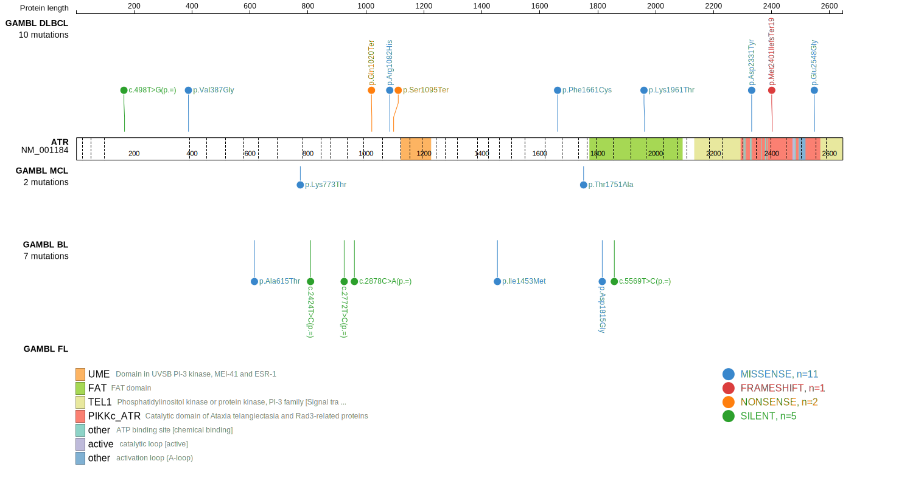
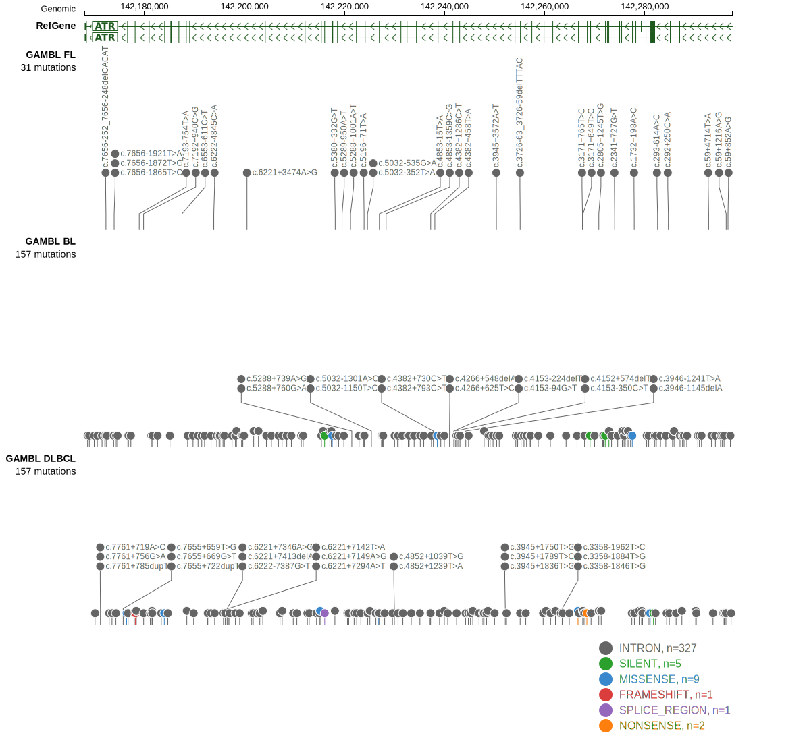

# ATR

## Relevance tier by entity

|Entity|Tier|Description                              |
|:------:|:----:|-----------------------------------------|
|DLBCL |2   |relevance in DLBCL not firmly established|

## Mutation incidence in large patient cohorts (GAMBL reanalysis)

|Entity|source        |frequency (%)|
|:------:|:--------------:|:-------------:|
|DLBCL |GAMBL genomes |2.68         |
|DLBCL |Schmitz cohort|4.89         |
|DLBCL |Reddy cohort  |2.80         |
|DLBCL |Chapuy cohort |3.85         |

## Mutation pattern and selective pressure estimates

|Entity|aSHM|Significant selection|dN/dS (missense)|dN/dS (nonsense)|
|:------:|:----:|:---------------------:|:----------------:|:----------------:|
|BL    |No  |No                   |0.459           |0.000           |
|DLBCL |No  |No                   |1.146           |3.261           |
|FL    |No  |No                   |0.000           |0.000           |

> [!NOTE]
> First described in DLBCL in 2017 by [Reddy A](https://pubmed.ncbi.nlm.nih.gov/28985567)

View coding variants in ProteinPaint [hg19](https://morinlab.github.io/LLMPP/GAMBL/ATR_protein.html)  or [hg38](https://morinlab.github.io/LLMPP/GAMBL/ATR_protein_hg38.html)

View all variants in GenomePaint [hg19](https://morinlab.github.io/LLMPP/GAMBL/ATR.html)  or [hg38](https://morinlab.github.io/LLMPP/GAMBL/ATR_hg38.html)

