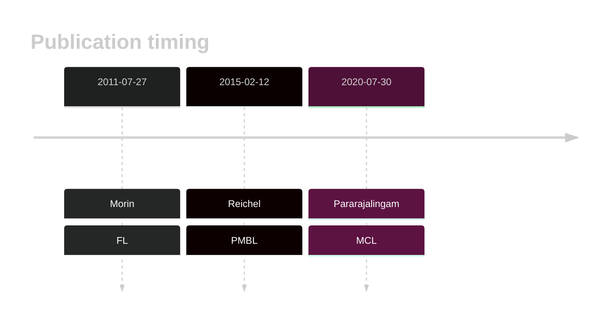

# B2M

## Overview

The B2M (β2-microglobulin) gene plays a crucial role in the function of the major histocompatibility complex (MHC) class I molecules, which are essential for immune system recognition of infected or malignant cells. B2M mutations in B-cell lymphomas, particularly in DLBCL and PMBCL, lead to reduced MHC class I expression, enabling tumor cells to evade immune detection and destruction by cytotoxic T cells. 
## History

## Relevance tier by entity

|Entity|Tier|Description                            |
|:------:|:----:|---------------------------------------|
||1|high-confidence PMBL/cHL/GZL gene|
| |1   |high-confidence DLBCL gene             |
|    |1   |high-confidence FL gene                |
|   |2   |relevance in MCL not firmly established|

## Mutation incidence in large patient cohorts (GAMBL reanalysis)

|Entity|source               |frequency (%)|
|:------:|:---------------------:|:-------------:|
|BL    |GAMBL genomes+capture| 2.31        |
|BL    |Thomas cohort        | 2.50        |
|BL    |Panea cohort         | 3.00        |
|DLBCL |GAMBL genomes        |15.11        |
|DLBCL |Schmitz cohort       |15.53        |
|DLBCL |Reddy cohort         |12.11        |
|DLBCL |Chapuy cohort        |11.97        |
|FL    |GAMBL genomes        | 8.55        |
|MCL   |GAMBL genomes        | 1.42        |

## Mutation pattern and selective pressure estimates

|Entity|aSHM|Significant selection|dN/dS (missense)|dN/dS (nonsense)|
|:------:|:----:|:---------------------:|:----------------:|:----------------:|
|BL    |No  |No                   | 9.379          | 56.571         |
|DLBCL |No  |Yes                  |60.843          |340.788         |
|FL    |No  |Yes                  |54.190          |326.834         |

> [!NOTE]
> First described in DLBCL in 2011 by [Morin RD](https://pubmed.ncbi.nlm.nih.gov/21796119). First described in FL in 2011 by [Morin RD](https://pubmed.ncbi.nlm.nih.gov/21796119). First described in MCL in 2020 by [Pararajalingam P](https://pubmed.ncbi.nlm.nih.gov/32160292)

 ## B2M Hotspots

| Chromosome |Coordinate (hg19) | ref>alt | HGVSp | 
 | :---:| :---: | :--: | :---: |
| chr15 | 45003745 | A>G | M1? |
| chr15 | 45003745 | A>T | M1? |
| chr15 | 45003745 | AGATGTCT>- | NA |
| chr15 | 45003746 | T>A | M1? |
| chr15 | 45003746 | T>C | M1? |
| chr15 | 45003746 | T>G | M1? |
| chr15 | 45003747 | G>A | M1? |
| chr15 | 45003747 | G>C | M1? |
| chr15 | 45003758 | T>A | V5E |
| chr15 | 45003761 | C>A | A6D |
| chr15 | 45003764 | T>C | L7S |
| chr15 | 45003764 | T>G | L7* |
| chr15 | 45003766 | G>C | A8P |
| chr15 | 45003767 | C>A | A8D |
| chr15 | 45003770 | T>A | V9E |
| chr15 | 45003770 | T>G | V9G |
| chr15 | 45003779 | T>A | L12Q |
| chr15 | 45003779 | T>C | L12P |
| chr15 | 45003779 | T>G | L12R |
| chr15 | 45003781 | C>T | L13F |
| chr15 | 45003782 | T>C | L13P |

View coding variants in ProteinPaint [hg19](https://morinlab.github.io/LLMPP/GAMBL/B2M_protein.html)  or [hg38](https://morinlab.github.io/LLMPP/GAMBL/B2M_protein_hg38.html)

View all variants in GenomePaint [hg19](https://morinlab.github.io/LLMPP/GAMBL/B2M.html)  or [hg38](https://morinlab.github.io/LLMPP/GAMBL/B2M_hg38.html)

## B2M Expression

<!-- ORIGIN: morinFrequentMutationHistonemodifying2011 -->
<!-- PMBL: reichelFlowSortingExome2015a -->
<!-- FL: morinFrequentMutationHistonemodifying2011 -->
<!-- MCL: pararajalingamCodingNoncodingDrivers2020 -->
<!-- DLBCL: morinFrequentMutationHistonemodifying2011 -->
## References
1.  Morin RD, Mendez-Lago M, Mungall AJ, Goya R, Mungall KL, Corbett RD, Johnson NA, Severson TM, Chiu R, Field M, Jackman S, Krzywinski M, Scott DW, Trinh DL, Tamura-Wells J, Li S, Firme MR, Rogic S, Griffith M, Chan S, Yakovenko O, Meyer IM, Zhao EY, Smailus D, Moksa M, Chittaranjan S, Rimsza L, Brooks-Wilson A, Spinelli JJ, Ben-Neriah S, Meissner B, Woolcock B, Boyle M, McDonald H, Tam A, Zhao Y, Delaney A, Zeng T, Tse K, Butterfield Y, Birol I, Holt R, Schein J, Horsman DE, Moore R, Jones SJM, Connors JM, Hirst M, Gascoyne RD, Marra MA. Frequent mutation of histone-modifying genes in non-Hodgkin lymphoma. Nature. 2011 Jul 27;476(7360):298–303. PMCID: PMC3210554
2.  Reichel J, Chadburn A, Rubinstein PG, Giulino-Roth L, Tam W, Liu Y, Gaiolla R, Eng K, Brody J, Inghirami G, Carlo-Stella C, Santoro A, Rahal D, Totonchy J, Elemento O, Cesarman E, Roshal M. Flow sorting and exome sequencing reveal the oncogenome of primary Hodgkin and Reed-Sternberg cells. Blood. 2015 Feb 12;125(7):1061–1072. PMID: 25488972
3.  Pararajalingam P, Coyle KM, Arthur SE, Thomas N, Alcaide M, Meissner B, Boyle M, Qureshi Q, Grande BM, Rushton C, Slack GW, Mungall AJ, Tam CS, Agarwal R, Dawson SJ, Lenz G, Balasubramanian S, Gascoyne RD, Steidl C, Connors J, Villa D, Audas TE, Marra MA, Johnson NA, Scott DW, Morin RD. Coding and noncoding drivers of mantle cell lymphoma identified through exome and genome sequencing. Blood. 2020 Jul 30;136(5):572–584. PMCID: PMC7440974
