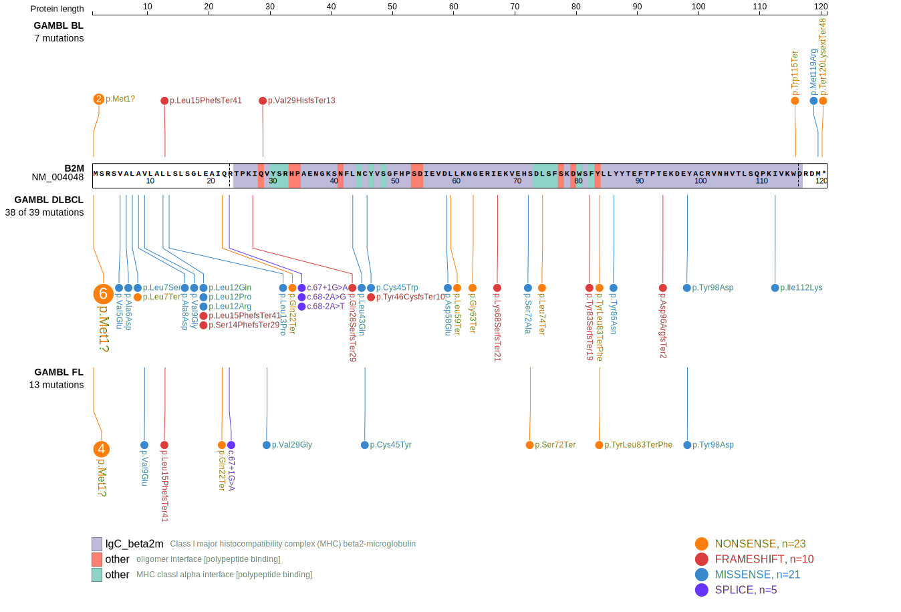
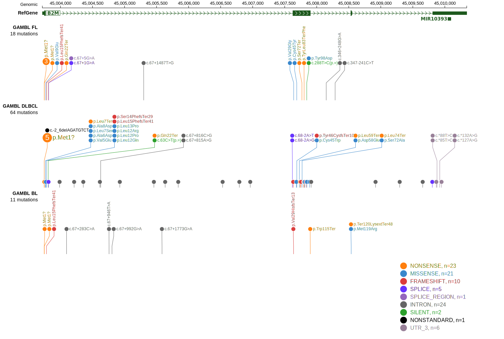

# B2M
## Overview

The B2M (β2-microglobulin) gene plays a crucial role in the function of the major histocompatibility complex (MHC) class I molecules, which are essential for immune system recognition of infected or malignant cells. B2M mutations in B-cell lymphomas, particularly in DLBCL and PMBCL, lead to reduced MHC class I expression, enabling tumor cells to evade immune detection and destruction by cytotoxic T cells. 

## Relevance tier by entity

|Entity|Tier|Description                            |
|:------:|:----:|---------------------------------------|
|BL    |2   |relevance in BL not firmly established |
|DLBCL |1   |high-confidence DLBCL gene             |
|FL    |1   |high-confidence FL gene                |
|MCL   |2   |relevance in MCL not firmly established|

## Mutation incidence in large patient cohorts (GAMBL reanalysis)

|Entity|source               |frequency (%)|
|:------:|:---------------------:|:-------------:|
|BL    |GAMBL genomes+capture| 2.31        |
|BL    |Thomas cohort        | 2.50        |
|BL    |Panea cohort         | 3.00        |
|DLBCL |GAMBL genomes        |15.11        |
|DLBCL |Schmitz cohort       |15.53        |
|DLBCL |Reddy cohort         |12.11        |
|DLBCL |Chapuy cohort        |11.97        |
|FL    |GAMBL genomes        | 8.55        |
|MCL   |GAMBL genomes        | 1.42        |

## Mutation pattern and selective pressure estimates

|Entity|aSHM|Significant selection|dN/dS (missense)|dN/dS (nonsense)|
|:------:|:----:|:---------------------:|:----------------:|:----------------:|
|BL    |No  |No                   | 9.379          | 56.571         |
|DLBCL |No  |Yes                  |60.843          |340.788         |
|FL    |No  |Yes                  |54.190          |326.834         |

> [!NOTE]
> First described in DLBCL in 2011 by [Morin RD](https://pubmed.ncbi.nlm.nih.gov/21796119). First described in FL in 2011 by [Morin RD](https://pubmed.ncbi.nlm.nih.gov/21796119). First described in MCL in 2020 by [Pararajalingam P](https://pubmed.ncbi.nlm.nih.gov/32160292)

 ## B2M Hotspots

| Chromosome |Coordinate (hg19) | ref>alt | HGVSp | 
 | :---:| :---: | :--: | :---: |
| chr15 | 45003745 | A>G | M1? |
| chr15 | 45003745 | A>T | M1? |
| chr15 | 45003745 | AGATGTCT>- | NA |
| chr15 | 45003746 | T>A | M1? |
| chr15 | 45003746 | T>C | M1? |
| chr15 | 45003746 | T>G | M1? |
| chr15 | 45003747 | G>A | M1? |
| chr15 | 45003747 | G>C | M1? |
| chr15 | 45003758 | T>A | V5E |
| chr15 | 45003761 | C>A | A6D |
| chr15 | 45003764 | T>C | L7S |
| chr15 | 45003764 | T>G | L7* |
| chr15 | 45003766 | G>C | A8P |
| chr15 | 45003767 | C>A | A8D |
| chr15 | 45003770 | T>A | V9E |
| chr15 | 45003770 | T>G | V9G |
| chr15 | 45003779 | T>A | L12Q |
| chr15 | 45003779 | T>C | L12P |
| chr15 | 45003779 | T>G | L12R |
| chr15 | 45003781 | C>T | L13F |
| chr15 | 45003782 | T>C | L13P |

View coding variants in ProteinPaint [hg19](https://morinlab.github.io/LLMPP/GAMBL/B2M_protein.html)  or [hg38](https://morinlab.github.io/LLMPP/GAMBL/B2M_protein_hg38.html)

View all variants in GenomePaint [hg19](https://morinlab.github.io/LLMPP/GAMBL/B2M.html)  or [hg38](https://morinlab.github.io/LLMPP/GAMBL/B2M_hg38.html)

## B2M Expression

## References
1. *Morin RD, Mendez-Lago M, Mungall AJ, Goya R, Mungall KL, Corbett RD, Johnson NA, Severson TM, Chiu R, Field M, Jackman S, Krzywinski M, Scott DW, Trinh DL, Tamura-Wells J, Li S, Firme MR, Rogic S, Griffith M, Chan S, Yakovenko O, Meyer IM, Zhao EY, Smailus D, Moksa M, Chittaranjan S, Rimsza L, Brooks-Wilson A, Spinelli JJ, Ben-Neriah S, Meissner B, Woolcock B, Boyle M, McDonald H, Tam A, Zhao Y, Delaney A, Zeng T, Tse K, Butterfield Y, Birol I, Holt R, Schein J, Horsman DE, Moore R, Jones SJ, Connors JM, Hirst M, Gascoyne RD, Marra MA. Frequent mutation of histone-modifying genes in non-Hodgkin lymphoma. Nature. 2011 Jul 27;476(7360):298-303. doi: 10.1038/nature10351. PMID: 21796119; PMCID: PMC3210554.*