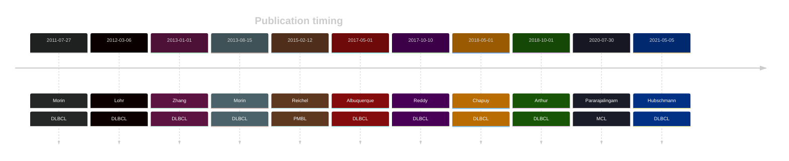

# B2M

## Overview

The B2M (β2-microglobulin) gene plays a crucial role in the function of the major histocompatibility complex (MHC) class I molecules, which are essential for immune system recognition of infected or malignant cells. 

## Experimental Evidence

B2M mutations in B-cell lymphomas, particularly in DLBCL and PMBCL, lead to reduced MHC class I expression, enabling tumor cells to evade immune detection and destruction by cytotoxic T cells. This is often accompanied by mutations in the β2-Microglobulin gene, which further aids in immune evasion.[@challa-malladiCombinedGeneticInactivation2011]

## History

## Relevance tier by entity

|Entity|Tier|Description                            |
|:------:|:----:|---------------------------------------|
||1 |high-confidence PMBL/cHL/GZL gene[@reichelFlowSortingExome2015]|
| |1   |high-confidence DLBCL gene[@morinFrequentMutationHistonemodifying2011]             |
|    |1   |high-confidence FL gene[@morinFrequentMutationHistonemodifying2011]                |
|   |2   |relevance in MCL not firmly established[@pararajalingamCodingNoncodingDrivers2020]|

## Mutation incidence in large patient cohorts (GAMBL reanalysis)

[[include:DLBCL_B2M.md]]
[[include:FL_B2M.md]]

## Mutation pattern and selective pressure estimates

[[include:dnds_B2M.md]]

## B2M Hotspots

| Chromosome |Coordinate (hg19) | ref>alt | HGVSp | 
 | :---:| :---: | :--: | :---: |
| chr15 | 45003745 | A>G | M1? |
| chr15 | 45003745 | A>T | M1? |
| chr15 | 45003745 | AGATGTCT>- | NA |
| chr15 | 45003746 | T>A | M1? |
| chr15 | 45003746 | T>C | M1? |
| chr15 | 45003746 | T>G | M1? |
| chr15 | 45003747 | G>A | M1? |
| chr15 | 45003747 | G>C | M1? |
| chr15 | 45003758 | T>A | V5E |
| chr15 | 45003761 | C>A | A6D |
| chr15 | 45003764 | T>C | L7S |
| chr15 | 45003764 | T>G | L7* |
| chr15 | 45003766 | G>C | A8P |
| chr15 | 45003767 | C>A | A8D |
| chr15 | 45003770 | T>A | V9E |
| chr15 | 45003770 | T>G | V9G |
| chr15 | 45003779 | T>A | L12Q |
| chr15 | 45003779 | T>C | L12P |
| chr15 | 45003779 | T>G | L12R |
| chr15 | 45003781 | C>T | L13F |
| chr15 | 45003782 | T>C | L13P |

View coding variants in ProteinPaint [hg19](https://morinlab.github.io/LLMPP/GAMBL/B2M_protein.html)  or [hg38](https://morinlab.github.io/LLMPP/GAMBL/B2M_protein_hg38.html)

View all variants in GenomePaint [hg19](https://morinlab.github.io/LLMPP/GAMBL/B2M.html)  or [hg38](https://morinlab.github.io/LLMPP/GAMBL/B2M_hg38.html)

## B2M Expression

<!-- ORIGIN: morinFrequentMutationHistonemodifying2011 -->
<!-- PMBL: reichelFlowSortingExome2015a -->
<!-- FL: morinFrequentMutationHistonemodifying2011 -->
<!-- MCL: pararajalingamCodingNoncodingDrivers2020 -->
<!-- DLBCL: morinFrequentMutationHistonemodifying2011 -->

## References
