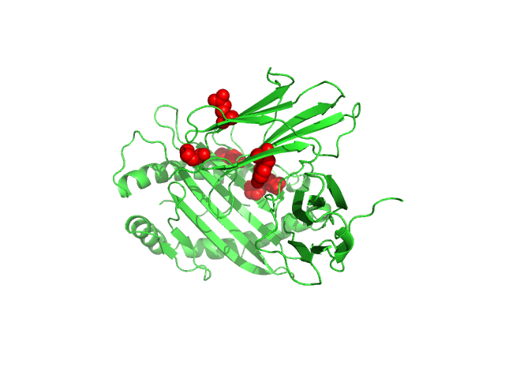
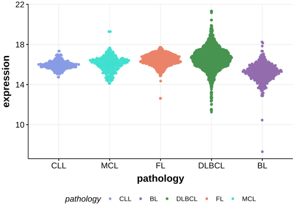

[[_TOC_]]

## Overview

The B2M (β2-microglobulin) gene plays a crucial role in the function of the major histocompatibility complex (MHC) class I molecules, which are essential for immune system recognition of infected or malignant cells. 

## Experimental Evidence

B2M mutations in B-cell lymphomas, particularly in DLBCL and PMBCL, lead to reduced MHC class I expression, enabling tumor cells to evade immune detection and destruction by cytotoxic T cells. This is often accompanied by mutations in the β2-Microglobulin gene, which further aids in immune evasion.[@challa-malladiCombinedGeneticInactivation2011]

## Relevance tier by entity

[[include:tables/table1_B2M.md]]

## Mutation incidence in large patient cohorts (GAMBL reanalysis)

### DLBCL
[[include:tables/DLBCL_B2M.md]]

### FL
[[include:tables/FL_B2M.md]]

### MCL
[[include:tables/MCL_B2M]]

### BL
[[include:tables/BL_B2M.md]]

## Mutation pattern and selective pressure estimates

[[include:tables/dnds_B2M.md]]

[[include:tables/hotspots/hotspots_B2M.md]]

[[include:tables/browser_B2M.md]]

## Expression

<!-- ORIGIN: morinFrequentMutationHistonemodifying2011 -->
<!-- PMBL: reichelFlowSortingExome2015a -->
<!-- FL: morinFrequentMutationHistonemodifying2011 -->
<!-- MCL: pararajalingamCodingNoncodingDrivers2020 -->
<!-- DLBCL: morinFrequentMutationHistonemodifying2011 -->

[[include:tables/mermaid_B2M.md]]

## References
