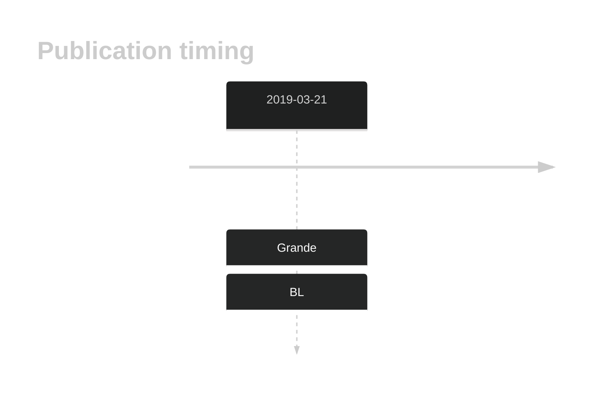

# BACH2

## History
Mutations in this gene were first described in BL in 2019 by Grande et al.1

## Relevance tier by entity

|Entity|Tier|Description                           |
|:------:|:----:|--------------------------------------|
|    |2-a | aSHM target; Although recurrent, the relevance of mutations in BL is tenuous [@grandeGenomewideDiscoverySomatic2019]|

## Mutation incidence in large patient cohorts (GAMBL reanalysis)

[[include:BL_BACH2.md]]

## Mutation pattern and selective pressure estimates

|Entity|aSHM|Significant selection|dN/dS (missense)|dN/dS (nonsense)|
|:------:|:----:|:---------------------:|:----------------:|:----------------:|
|BL    |Yes |No                   |0.652           | 0.000          |
|DLBCL |Yes |No                   |0.949           | 0.000          |
|FL    |Yes |No                   |0.000           |28.997          |

## aSHM regions

|chr_name|hg19_start|hg19_end|region                                                                                   |regulatory_comment|
|:--------:|:----------:|:--------:|:-----------------------------------------------------------------------------------------:|:------------------:|
|chr6    |90981034  |91016134|[TSS](https://genome.ucsc.edu/s/rdmorin/GAMBL%20hg19?position=chr6%3A90981034%2D91016134)|NA                |

View coding variants in ProteinPaint [hg19](https://morinlab.github.io/LLMPP/GAMBL/BACH2_protein.html)  or [hg38](https://morinlab.github.io/LLMPP/GAMBL/BACH2_protein_hg38.html)

View all variants in GenomePaint [hg19](https://morinlab.github.io/LLMPP/GAMBL/BACH2.html)  or [hg38](https://morinlab.github.io/LLMPP/GAMBL/BACH2_hg38.html)

## BACH2 Expression

## References

<!-- ORIGIN: grandeGenomewideDiscoverySomatic2019 -->
<!-- BL: grandeGenomewideDiscoverySomatic2019 -->
